# Vivado HLS Design Flow Lab

## Introduction

This lab provides a basic introduction to high-level synthesis using the Vivado HLS tool flow. You will use
Vivado HLS in GUI mode to create a project. You will simulate, synthesize, and implement the provided
design.

## Objective

After completing this lab, you will be able to:

* Create a new project using Vivado HLS GUI
* Simulate a design
* Synthesize a design
* Implement a design
* Perform design analysis using the Analysis capability of Vivado HLS
* Analyze simulator output using Vivado and XSim simulator

## Steps

### Create a New Project

#### 1-1 Create a new project in Vivado HLS targeting PYNQ-Z1 or PYNQ-Z2 board

1-1-1. Launch Vivado HLS: Select **Start > All Programs > Xilinx Design Tools > Vivado 2018.2 > Vivado HLS > Vivado HLS 2018.2**
    

    
    

    

    <i>Figure1.Getting Started view of Vivado-HLS</i>
    

1-1-2. In the Getting Started GUI, click on **Create New Project**. The **New Vivado HLS Project** wizard opens.

1-1-3. Click the **Browse…** button of the Location field and browse to **c:\xup\hls\labs\lab1** and then click **OK**.

1-1-4. For Project Name, type **matrixmul.prj**
    

    
    

    

    <i>Figure2.New Vivado HLS Project wizard</i>
    

1-1-5. Click Next.

1-1-6. In the Add/Remove Files window, type **matrixmul** as the Top Function name (the provided source file contains the function, to be synthesized, called matrixmul).

1-1-7. Click the **Add Files…** button, select matrixmul.cpp file from the **c:\xup\hls\labs\lab1 folder**, and then click Open.

1-1-8. Click **Next**.

1-1-9. In the Add/Remove Files for the testbench, click the **Add Files…** button, select matrixmul_test.cpp file from the **c:\xup\hls\labs\lab1** folder and click **Open**.

1-1-10. Select the matrixmul_test.cpp in the files list window and click the **Edit CFLAG…** button, type **-DHW_COSIM**, and click OK. (This defines a custom flag that will be used later.)

1-1-11. Click **Next**.

1-1-12. In the Solution Configuration page, leave Solution Name field as solution1 and set the clock period as 10。

Click the … button in the Part Selection section.

1-1-13. In the Device Selection Dialog page, select Parts Specify field, and select the following filters to select the **xc7z020clg400-1** part and click **OK**.
    

    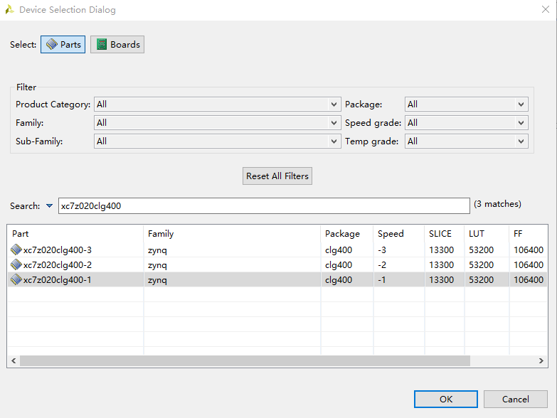
    

    

    <i>Figure3. Using Parts Specify option in Part Selection Dialog</i>
    

1-1-14. Click **Finish**.

You will see the created project in the Explorer view. Expand various sub-folders to see the entries under each sub-folder.
    

    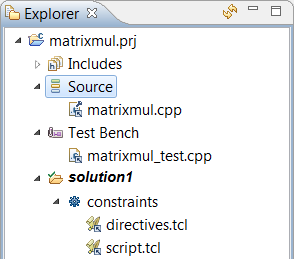
    

    

    <i>Figure4. Explorer Window</i>
    

 
1-1-15. Double-click on the matrixmul.cpp under the source folder to open its content in the information pane.
    

    
    

    

    <i>Figure5. The Design under consideration</i>
    

It can be seen that the design is a matrix multiplication implementation, consisting of three nested loops. The Product loop is the inner most loop performing the actual Matrix elements product and sum. The Col loop is the outer-loop which feeds the next column element data with the passed row element data to the Product loop. Finally, Row is the outer-most loop. The res[i][j]=0 (line
79) resets the result every time a new row element is passed and new column element is used.

### Run C Simulation

#### 2-1. Run C simulation to view the expected output.

2-1-1. Select **Project > Run C Simulation**, and Click **OK** in the C Simulation Dialog window.

2-1-2. The files will be compiled and you will see the output in the Console window.
    

    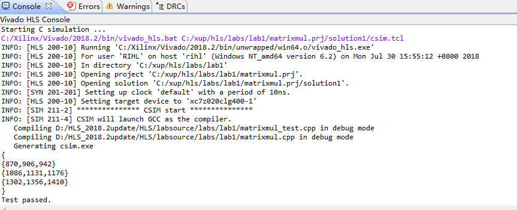
    

    

    <i>Figure6. Program output</i>
    

2-1-3. Double-click on **matrixmul_test.cpp** under testbench folder in the Explorer to see the content.

You should see two input matrices initialized with some values and then the code that executesthe algorithm. If HW_COSIM is defined (as was done during the project set-up) then the matrixmul function is called and compares the output of the computed result with the one returned from the called function, and prints Test passed if the results match.

If HW_COSIM had not been defined then it will simply output the computed result and not call the
matrixmul function.

### Run Debugger

#### 3-1. Run the application in debugger mode and understand the behavior of the program.

3-1-1. Select **Project > Run C Simulation**. Select the **Launch Debugger** option and click OK.

The application will be compiled with –g option to include the debugging information, the compiled application will be invoked, and the debug perspective will be opened automatically.

3-1-2. The Debug perspective will show the matrixmul_test.cpp in the source view, argc and argv variables defined in the Variables view, Outline view showing the objects which are in the current scope, thread created and the program suspended at the main() function entry point.
    

    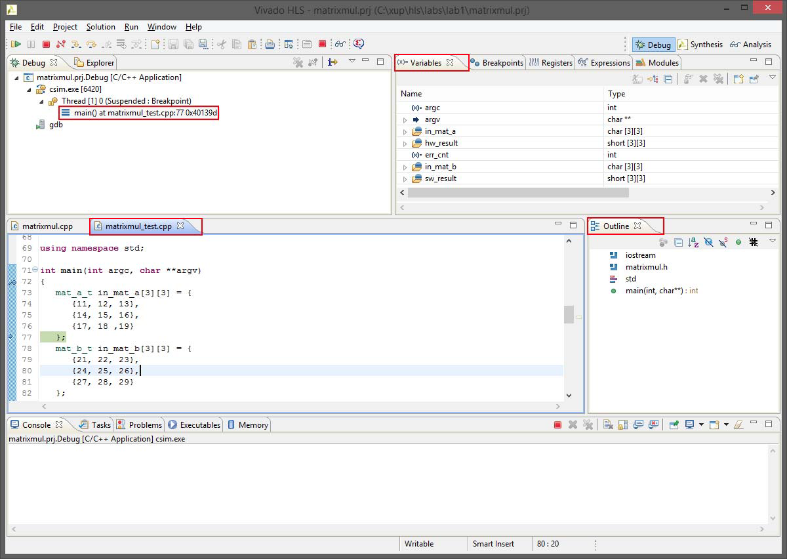
    

    

    <i>Figure7. A Debug perspective</i>
    

    
3-1-3. Scroll-down in the source view, and double-click in the blue margin at line 105 where it is about to
output “{“ in the output console window. This will set a break-point at line 105. .

The breakpoint is marked with a blue circle, and a tick
    

    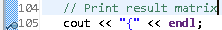
    

    

    

    
3-1-4. Similarly, set a breakpoint at line 101 on the matrixmul() function

3-1-5. Using the **Step Over** (F6) button several times, observe the execution progress, and observe the variable values updating, as well as computed software result.
    

    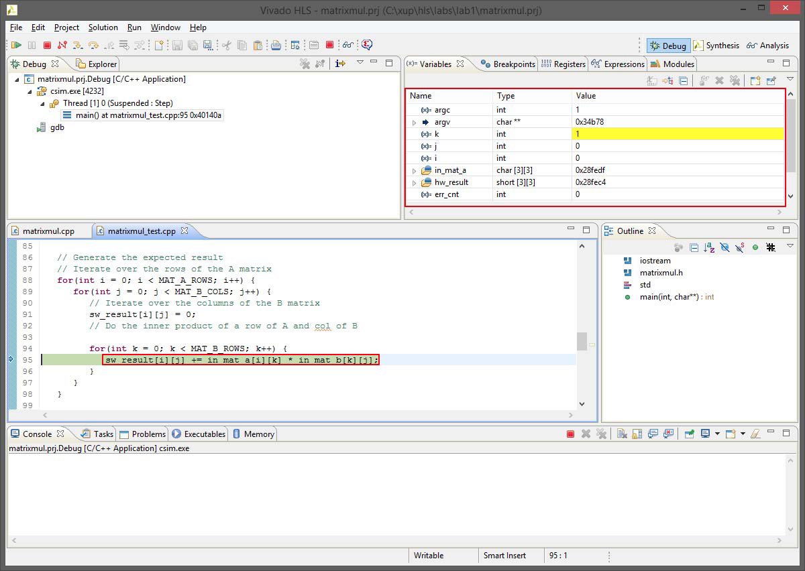
    

    

    <i>Figure 9. Debugger’s intermediate output view</i>
    

3-1-6. Now click the **Resume** button or F8 to complete the software computation and stop at line 101.

3-1-7. Observe the following computed software result in the variables view.
    

    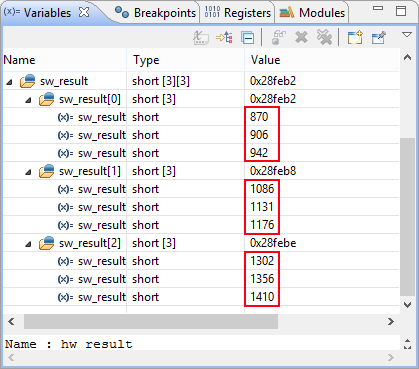
    

    

    <i>Figure 10. Software computed result</i>
    

3-1-8. Click on the **Step Into** (F5) button to traverse into the matrixmul module, the one that we will synthesize, and observe that the execution is paused on line 75 of the module.

3-1-9. Using the **Step Over** (F6) several times, observe the computed results. Once satisfied, you can use the **Step Return** (F7) button to return from the function.

3-1-10. The program execution will suspend at line 105 as we had set a breakpoint. Observe the software and hardware (function) computed results in the Variables view.
    

    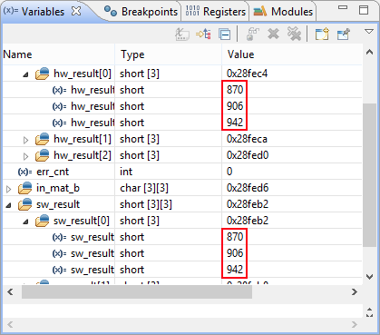
    

    

    <i>Figure 11. Computed results</i>
    

3-1-11. Set a breakpoint on line 134 (return err_cnt;), and click on the **Resume** button.

The execution will continue until the breakpoint is encountered. The console window will show
the results as seen earlier (Figure 7).

3-1-12. Press the **Resume** button or **Terminate** button to finish the debugging session.

### Synthesize the Design

#### 4-1. Switch to Synthesis view and synthesize the design with the defaults. Viewthe synthesis results and answer the question listed in the detailed section of this step.

4-1-1. Switch to the Synthesis view by clicking **Synthesis** button on the tools bar.

4-1-2. Select **Solution > Run C Synthesis > Active Solution** to start the synthesis process.

4-1-3. When synthesis is completed, the Synthesis Results will be displayed along with the Outline pane. Using the Outline pane, one can navigate to any part of the report with a simple click.
    

    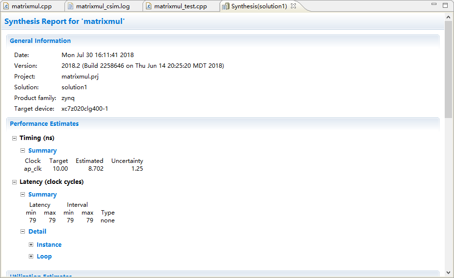
    

    

    <i>Figure 12. Report view after synthesis is completed</i>
    

    
4-1-4. If you expand **solution1** in Explorer, several generated files including report files will become accessible.
    

    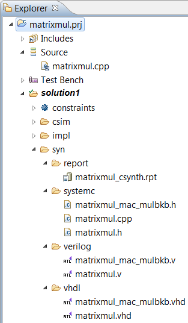
    

    

    <i>Figure 13. Explorer view after the synthesis process</i>
    

    
Note that when the syn folder under the Solution1 folder is expanded in the Explorer view, it will show report, systemC, verilog, and vhdl sub-folders under which report files, and generated source (vhdl, verilog, header, and cpp) files. By double-clicking any of these entries will open the corresponding file in the information pane.

Also note that if the target design has hierarchical functions, reports corresponding to lower-level functions are also created.

4-1-5. The Synthesis Report shows the performance and resource estimates as well as estimated latency in the design.

4-1-6. Using scroll bar on the right, scroll down into the report and answer the following question.

**Question1:**

Estimated clock period:

Worst case latency:

Number of DSP48E used:

Number of FFs used:

Number of LUTs used:

4-1-7. The report also shows the top-level interface signals generated by the tools.
    

    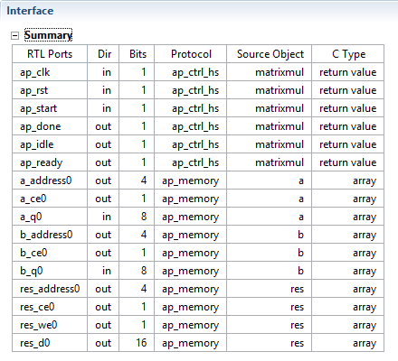
    

    

    <i>Figure 14. Generated interface signals</i>
    

You can see ap_clk, ap_rst and ap_ idle and ap_ready control signals are automatically added to the design by default. These signals are used as handshaking signals to indicate when the design is ready to begin the next computation command (ap_ready), when the next computation is started (ap_start), and when the computation is completed (ap_done). Other signals are generated based on the input and output signals in the design and their default or specified interfaces.

### Analyze using Analysis Perspective

#### 5-1. Switch to the Analysis Perspective and understand the design behavior.

5-1-1. Select **Solution > Open Analysis Perspective** or click on Analysis button on tools bar to open the analysis viewer.

The Analysis perspective consists of 4 panes as shown below. Note that the module and loops hierarchies are displayed unexpanded by default.

The Module Hierarchy pane shows both the performance and area information for the entire design and can be used to navigate through the hierarchy. The Performance Profile pane is visible and shows the performance details for this level of hierarchy. The information in these two panes is similar to the information reviewed earlier in the synthesis report.

The Schedule Viewer is also shown in the right-hand side pane. This view shows how the operations in this particular block are scheduled into clock cycles.
    

    
    

    

    <i>Figure 15. Analysis perspective</i>
    

    
5-1-2. Click on ‘>’ of loop Row to expand, and then similarly click on sub-loops Col and Product to fullyexpand the loop hierarchy.
    

    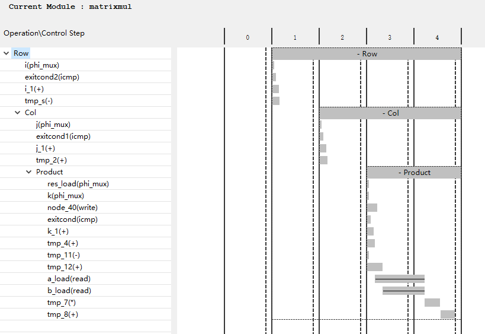
    

    

    <i>Figure 16. Performance matrix showing top-level Row operation</i>
    

From this we can see that in the first state (C1) of the Row the loop exit condition is checked and there is an add operation performed. This addition is likely the counter to count the loop iterations, and we can confirm this.

5-1-3. Select the block for the adder in state C1, right-click and select Goto Source.

The source code pane will be opened, highlighting line 75 where the Row loop index is being tested and incremented. In the next state (C2) it starts to execute the Col loop.
    

    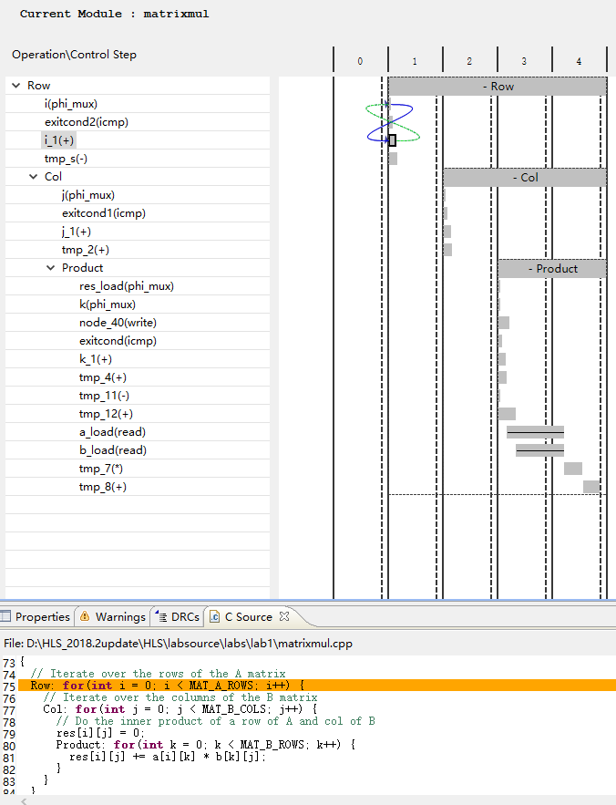
    

    

    <i>Figure 17. Cross probing into the source file</i>
    

5-1-4. Click on the C2-8 cell in the Col loop to see the source code highlighting (line 79) update.

5-1-5. Expand the Performance Profile hierarchy and note iteration latencies, Trip counts, and overall latencies for each of the nested loops.
    

    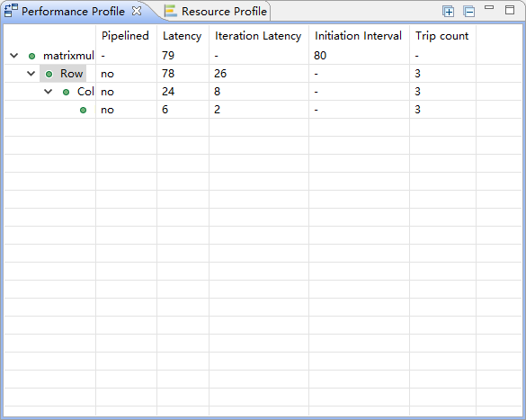
    

    

    <i>Figure 18. The Performance Profile output</i>
    

5-1-6. Click next to the matrixmul entry in the Module Hierarchy and observe that the entry is not expanded, since there are no lower-level functions defined in the design.

5-1-7. Select the Resource Profile tab and observe various resources and where they have been used. You can expand Expressions and Registers sections to see how the resources are being used by which operations.
    

    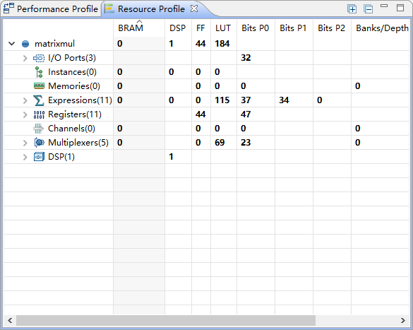
    

    

    <i>Figure 19. The Resource Profile tab view</i>
    

    
5-1-8. Click on the **Synthesis** tool bar button to switch back to the Synthesis view.

### Run C/RTL Co-simulation

#### 6-1. Run the C/RTL Co-simulation with the default settings of VHDL. Verify that the simulation passes.

6-1-1. Select **Solution > Run C/RTL Cosimulation** or if you are in the synthesis view, click  on the check mark toolbar button to open the dialog box so the desired simulations can be selected and run.

A C/RTL Co-simulation Dialog box will open.

6-1-2. Make sure the **VHDL** option is selected.

This allows the simulation to be performed using VHDL. To perform the verification using Verilog, you can select Verilog and choose the simulator from the drop-down menu or let the tools use the first simulator that appears in the PATH variable.
    

    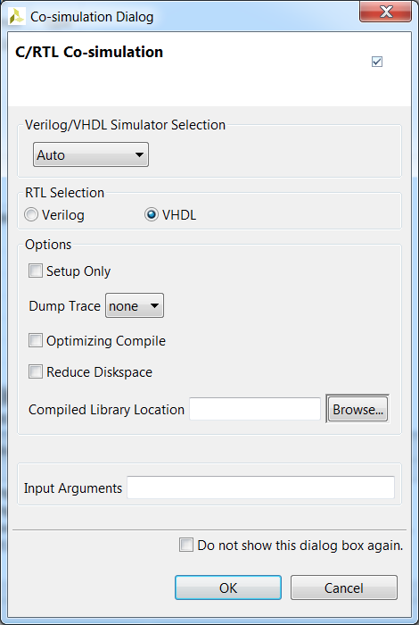
    

    

    <i>Figure 20. A C/RTL Co-simulation Dialog</i>
    

6-1-3. Click OK to run the VHDL simulation.

The C/RTL Co-simulation will run, generating and compiling several files, and then simulating the design. It goes through three stages.

* First, the VHDL test bench is executed to generate input stimuli for the RTL design
* Second, an RTL test bench with newly generated input stimuli is created and the RTL
simulation is then performed
* Finally, the output from the RTL is re-applied to the VHDL test bench to check the results

In the console window you can see the progress and also a message that the test is passed.
This eliminates writing a separate testbench for the synthesized design.
    

    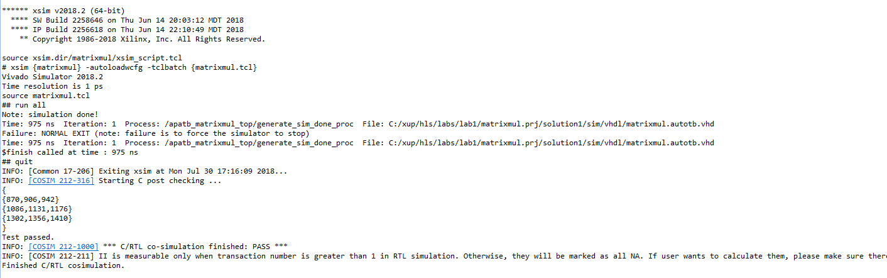
    

    

    <i>Figure 21. Console view showing simulation progress</i>
    

6-1-4. Once the simulation verification is completed, the simulation report tab will open showing the
results. The report indicates if the simulation passed or failed. In addition, the report indicates the
measured latency and interval.

Since we have selected only VHDL, the result shows the latencies and interval (initiation) which
indicates after how many clock cycles later the next input can be provided. Since the design is
not pipelined, it will be latency+1 clock cycles.
    

    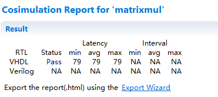
    

    

    <i>Figure 22. Co-simulation results</i>
    

### Viewing Simulation Results in Vivado

#### 7-1. Run Verilog simulation with Dump Trace option selected.

7-1-1. Select **Solution > Run C/RTL Co-simulation** or click on the check mark button in the Synthesis view to open the dialog box so the desired simulations can be run.

7-1-2. Click on the **Verilog RTL** Selection option, leaving Verilog/VHDL Simulator Section option to Auto.
    

    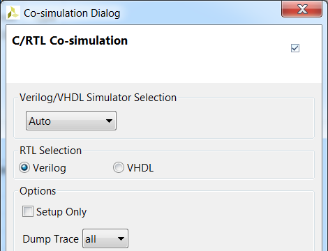
    

    

    <i>Figure 23. Setting up for Verilog simulation and dump trace</i>
    

When RTL verification completes the co-simulation report automatically opens showing the Verilog simulation has passed (and the measured latency and interval). In addition, because the Dump Trace option was used and Verilog was selected, two trace files entries can be seen in the Verilog simulation directory.
    

    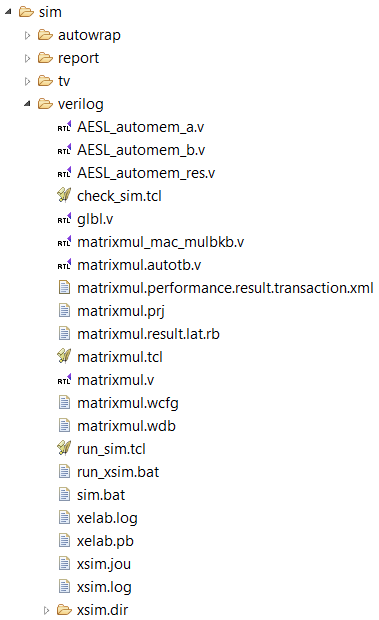
    

    

    <i>Figure 24. Explorer view after the Verilog RTL co-simulation run</i>
    

The Co-simulation report shows the test was passed for Verilog along with latency and Interval
results.
    

    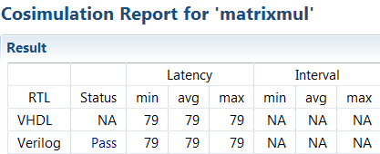
    

    

    <i>Figure 25. Cosimulation report</i>
    

#### 7-2. Analyze the dumped traces.

7-2-1. Click on the wave viewer button on tools bar to open the wave viewer.

This will start Vivado 2018.2 and open the wave viewer.

7-2-3. Click on the zoom fit tool button ( ) to see the entire simulation of one iteration.

7-2-4. Select a_address0 in the waveform window, right-click and select **Radix > Unsigned Decimal**.
Similarly, do the same for b_address0 and res_address0 signals.

7-2-5. Similarly, set the a_q0, b_q0, and res_d0 radix to Signed Decimal.

You should see the output similar to shown below.
    

    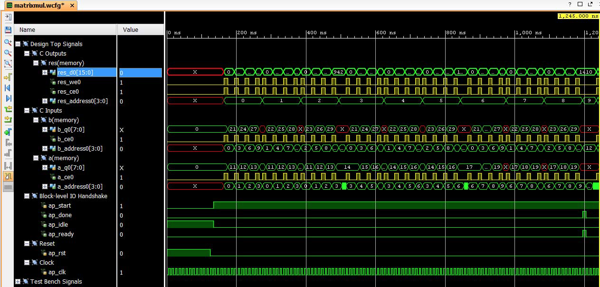
    

    

    <i>Figure 26. Full waveform showing iteration worth simulation</i>
    

Note that as soon as ap_start is asserted, ap_idle has been de-asserted indicating that the
design is in computation mode. The ap_idle signal remains de-asserted until ap_done is
asserted, indicating completion of the process. This indicates 79 clock cycles latency.

7-2-6. Using the Zoom In button, view area of ~160 ns and ~550 ns.
    

    
    

    

    <i>Figure 27. Zoomed view</i>
    

Observe that the design expects element data by providing a_address0, a_ceo, b_address0,
b_ceo signals and outputs result using res_d0, res_we0, and res_ce0.

7-2-7. View various part of the simulation and try to understand how the design works.

7-2-8. When done, close Vivado by selecting **File > Exit**. Click **OK** if prompted, and then **Discard** to
close the program without saving.

### Export RTL and Implement

#### 8-1. In Vivado HLS, export the design, selecting VHDL as a language, and run the implementation by selecting Evaluate option.

8-1-1. In Vivado-HLS, select Solution > Export RTL or click on the button on tools bar to open the dialog box so
the desired implementation can be run.

An Export RTL Dialog box will open.
    

    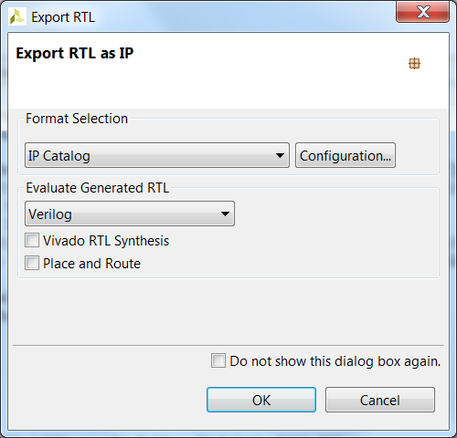
    

    

    <i>Figure 28. A Export RTL Dialog box</i>
    

With default settings (shown above), the IP packaging process will run and create a package for
the Vivado IP Catalog. Another option available from the Format Selection drop-down menu, is to
create System Generator for DSP.

8-1-2. Click on the drop-down menu of the **Evaluate Generated RTL** field and select **VHDL**.

8-1-3. Click on the Vivado synthesis, place and route check box to run the implementation tool.
    

    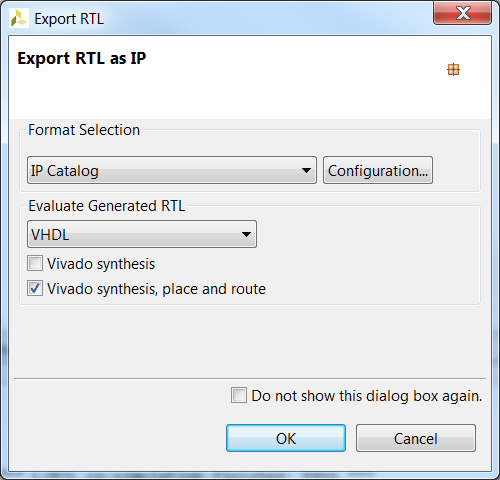
    

    

    <i>Figure 29. Selecting Evaluate options</i>
    

8-1-4. Click OK and the implementation run will begin.

You can observe the progress in the Vivado HLS Console window. It goes through several phases:

* Exporting RTL as an IP in the IP-XACT format
* RTL evaluation, since we selected Evaluate option
** Goes through Synthesis
** Goes through Placement and Routing
    

    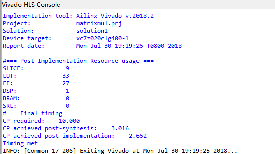
    

    

    <i>Figure 30. Console view</i>
    

When the run is completed the implementation report will be displayed in the information pane.
    

    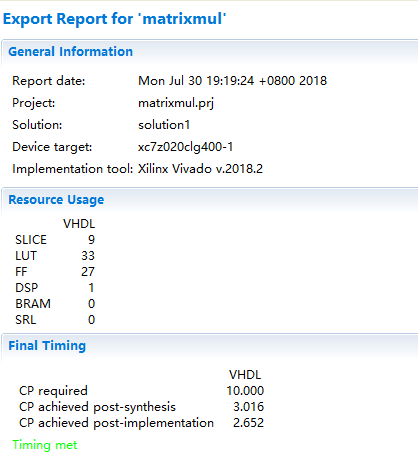
    

    

    <i>Figure 31. Implementation results in Vivado HLS </i>
    

Observe that the timing constraint was met, the achieved period, and the type and amount of resources used.
    

    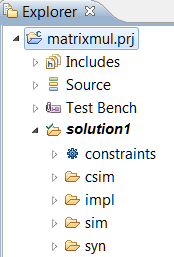
    

    

    <i>Figure 32. Explorer view after the RTL Export run </i>
    

8-1-6. Expand the Verilog and vhdl sub-folders and observe that the Verilog sub-folder only has the rtl
file whereas the vhdl sub-folder has several files and sub-folders as the synthesis and
implementation runs were made for it.

It includes project.xpr file (the Vivado project file), matrixmul.xdc file (timing constraint file),
project.runs folder (which includes synth_1 and impl_1 sub-folders created by the synthesis and
implementation runs) among others.
    

    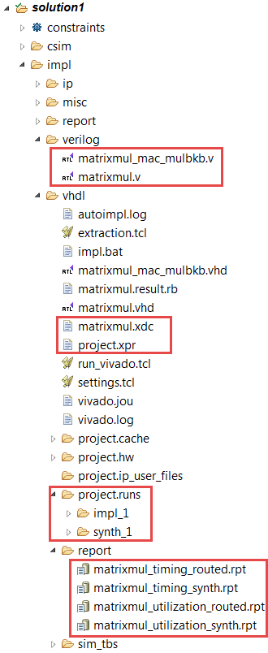
    

    

    <i>Figure 33. The implementation directory </i>
    

8-1-7. Expand the ip folder and observe the IP packaged as a zip file (xilinx_com_hls_matrixmul_1_0.zip), ready for adding to the Vivado IP catalog.
    

    
    

    

    <i>Figure 34. The ip folder content</i>
    

8-1-8. Close Vivado HLS by selecting **File > Exit**.

## Conclusion

In this lab, you completed the major steps of the high-level synthesis design flow using Vivado HLS. You
created a project, adding source files, synthesized the design, simulated the design, and implemented the
design. You also learned how to use the Analysis capability to understand the scheduling and binding.

### Answers
1. Answer the following questions:
Estimated clock period: 8.70 ns 
Worst case latency: 79 clock cycles 
Number of DSP48E used: 1
Number of FFs used: 44 
Number of LUTs used: 184 

