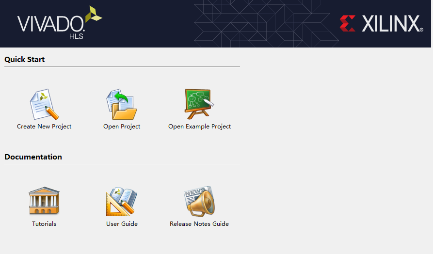
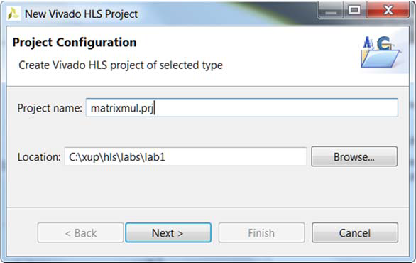

# Vivado HLS Design Flow Lab

## Introduction

This lab provides a basic introduction to high-level synthesis using the Vivado HLS tool flow. You will use
Vivado HLS in GUI mode to create a project. You will simulate, synthesize, and implement the provided
design.

## Objective

After completing this lab, you will be able to:

* Create a new project using Vivado HLS GUI
* Simulate a design
* Synthesize a design
* Implement a design
* Perform design analysis using the Analysis capability of Vivado HLS
* Analyze simulator output using Vivado and XSim simulator

## Steps

### Create a New Project

#### 1-1 Create a new project in Vivado HLS targeting PYNQ-Z1 or PYNQ-Z2 board

1-1-1. Launch Vivado HLS: Select **Start > All Programs > Xilinx Design Tools > Vivado 2018.2 > Vivado HLS > Vivado HLS 2018.2**
    

    
    

    

    <i>Getting Started view of Vivado-HLS</i>
    

1-1-2. In the Getting Started GUI, click on **Create New Project**. The **New Vivado HLS Project** wizard opens.

1-1-3. Click the **Browse…** button of the Location field and browse to **c:\xup\hls\labs\lab1** and then click **OK**.

1-1-4. For Project Name, type **matrixmul.prj**
    

    
    

    

    <i>New Vivado HLS Project wizard</i>
    

1-1-5. Click Next.

1-1-6. In the Add/Remove Files window, type **matrixmul** as the Top Function name (the provided source file contains the function, to be synthesized, called matrixmul).

1-1-7. Click the **Add Files…** button, select matrixmul.cpp file from the **c:\xup\hls\labs\lab1 folder**, and then click Open.

1-1-8. Click **Next**.

1-1-9. In the Add/Remove Files for the testbench, click the **Add Files…** button, select matrixmul_test.cpp file from the **c:\xup\hls\labs\lab1** folder and click **Open**.
