# Improving Performance Lab

## Introduction

This lab introduces various techniques and directives which can be used in Vivado HLS to improve
design performance. The design under consideration accepts an image in a (custom) RGB format,
converts it to the Y’UV color space, applies a filter to the Y’UV image and converts it back to RGB.

## Objectives

After completing this lab, you will be able to:

* Add directives in your design
* Understand the effect of INLINE directive
* Improve performance using PIPELINE directive
* Distinguish between DATAFLOW directive and Configuration Command functionality

## Steps

### Create a Vivado HLS Project from Command Line

#### Validate your design using Vivado HLS command line window. Create a new Vivado HLS project from the command line.

1-1-1. Launch Vivado HLS: **Select Start > All Programs > Xilinx Design Tools > Vivado 2018.2 > Vivado HLS > Vivado HLS 2018.2 Command Prompt**.

1-1-2. In the Vivado HLS Command Prompt, change directory to c:\xup\hls\labs\lab2.

1-1-3. A self-checking program (yuv_filter_test.c) is provided. Using that we can validate the design. A Makefile is also provided. Using the Makefile, the necessary source files can be compiled and the compiled program can be executed. You can examine the contents of these files and the project directory. In the Vivado HLS Command Prompt, type make to compile and execute the program. (You might need to set up the system environment variable for make command)
    

    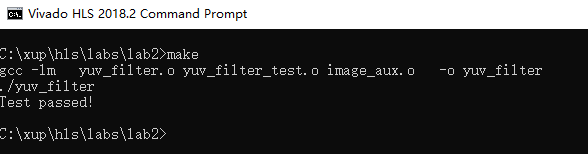
    

    

    <i>Validating the design</i>
    

Note that the source files (yuv_filter.c, yuv_filter_test.c, and image_aux.c) were compiled, then
yuv_filter executable program was created, and then it was executed. The program tests the
design and outputs Test Passed message.

1-1-4. A Vivado HLS tcl script file (pynq_yuv_filter.tcl) is provided and can be used to create a Vivado HLS project.

1-1-5. Type vivado_hls –f pynq_yuv_filter.tcl in the Vivado HLS Command Prompt window to create the project targeting the Pynq.

The project will be created and Vivado HLS.log file will be generated.

1-1-6. Open the **vivado_hls.log** file from c:\xup\hls\labs\lab2 using any text editor and observe the following sections:

* Creating directory and project called yuv_filter.prj within it, adding design files to the project, setting solution name as solution1, setting target device, setting desired clock period, and importing the design and testbench files (Figure 2).
* Synthesizing (Generating) the design which involves scheduling and binding of each functions and sub-function (Figure 3).
* Generating RTL of each function and sub-function in SystemC, Verilog, and VHDL languages (Figure 4).
    

    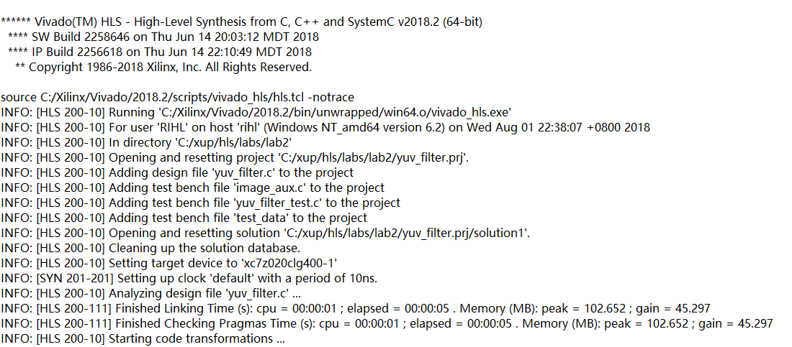
    

    

    <i>Creating project and setting up parameters</i>
    

    

    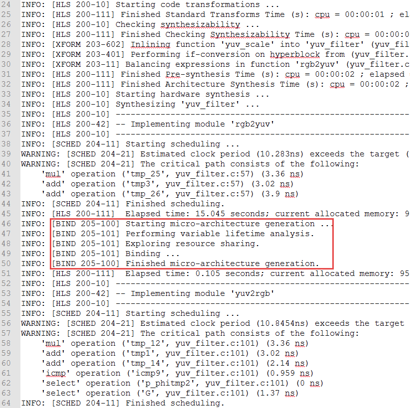
    

    

    <i>Synthesizing (Generating) the design</i>
    

    

    
    

    

    <i>Generating RTL</i>
    

1-1-7. Open the created project (in GUI mode) from the Vivado HLS Command Prompt window, by typing **vivado_hls –p yuv_filter.prj**.

The Vivado HLS will open in GUI mode and the project will be opened.

### Analyze the Created Project and Results

#### 2-1. Open the source file and note that three functions are used. Look at the results and observe that the latencies are undefined (represented by ?).

2-1-1. In Vivado HLS GUI, expand the source folder in the Explorer view and double-click yuv_filter.c
to view the content.

* The design is implemented in 3 functions: rgb2yuv, yuv_scale and yuv2rgb.
* Each of these filter functions iterates over the entire source image (which has maximum dimensions specified in image_aux.h), requiring a single source pixel to produce a pixel in the result image.
* The scale function simply applies individual scale factors, supplied as top-level arguments to the Y’UV components.
* Notice that most of the variables are of user-defined (typedef) and aggregate (e.g. structure, array) types.
* Also notice that the original source used malloc() to dynamically allocate storage for the internal image buffers. While appropriate for such large data structures in software, malloc() is not synthesizable and is not supported by Vivado HLS.
* A viable workaround is conditionally compiled into the code, leveraging the __SYNTHESIS__ macro. Vivado HLS automatically defines the __SYNTHESIS__ macro when reading any code. This ensure the original malloc() code is used outside of synthesis but Vivado HLS will use the workaround when synthesizing.

2-1-2. Expand the **syn > report** folder in the Explorer view and double-click yuv_filter_csynh.rpt entry to open the synthesis report.

2-1-3. Each of the loops in this design has variable bounds – the width and height are defined by
members of input type image_t. When variables bounds are present on loops the total latency of
the loops cannot be determined: this impacts the ability to perform analysis using reports. Hence,
“?” is reported for various latencies.
    

    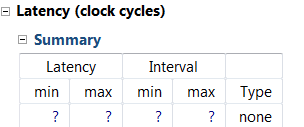
    

    

    <i>Latency computation</i>
    

### Apply TRIPCOUNT Pragma

#### 3-1 Open the source file and uncomment pragma lines, re-synthesize, and observe the resources used as well as estimated latencies. Answer the questions listed in the detailed section of this step.

3-1-1. To assist in providing loop-latency estimates, Vivado HLS provides a TRIPCOUNT directive
which allows limits on the variables bounds to be specified by the user. In this design, such
directives have been embedded in the source code, in the form of #pragma statements.

3-1-2. Uncomment the #pragma lines (50, 53, 90, 93, 130, 133) to define the loop bounds and save the
file.

3-1-3. Synthesize the design by selecting **Solution > Run C Synthesis > Active Solution**. View the
synthesis report when the process is completed.
    

    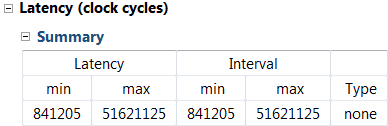
    

    

    <i>Latency computation after applying TRIPCOUNT pragma</i>
    

3-1-4. Looking at the report, and answer the following question.

#### Question 1

Estimated clock period:

Worst case latency:

Number of DSP48E used:

Number of BRAMs used:

Number of FFs used:

Number of LUTs used:

3-1-5. Scroll the Console window and note that yuv_scale function is automatically inline into the
yuv_filter function.
    

    
    

    

    <i>Vivado HLS automatically inlining function</i>
    

3-1-6. Observe that there are three entries – rgb2yuv.rpt, yuv_filter.rpt, and yuv2rgb.rpt under the syn
report folder in the Explorer view. There is no entry for yuv_scale.rpt since the function was
inlined into the yuv_filter function.

You can access lower level module’s report by either traversing down in the top-level report under
components (under Utilization Estimates > Details > Component) or from the reports container in
the project explorer.

3-1-7. Expand the Summary of loop latency and note the latency and trip count numbers for the
yuv_scale function. Note that the YUV_SCALE_LOOP_Y loop latency is 6X the specified
TRIPCOUNT, implying that 6 cycles are used for each of the iteration of the loop.
    

    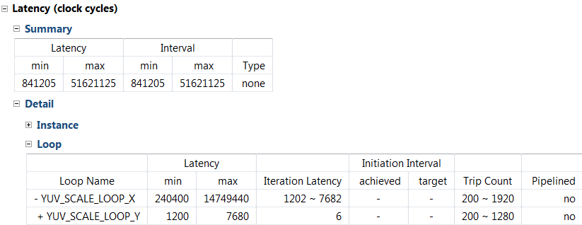
    

    

    <i>Loop latency</i>
    

3-1-8. You can verify this by opening an analysis perspective view, expanding the
**YUV_SCALE_LOOP_X** entry, and then expanding the **YUV_SCALE_LOOP_Y** entry.
    

    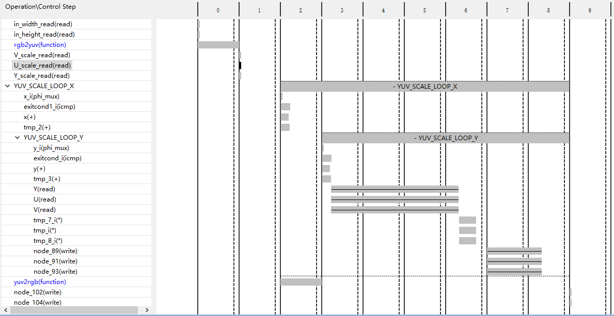
    

    

    <i>Design analysis view of the YUV_SCALE_LOOP_Y loop</i>
    

3-1-9. In the report tab, expand **Detail > Instance section** of the Utilization Estimates and click on the
**grp_rgb2yuv_fu_244 (rgb2yuv)** entry to open the report.

3-1-10. Answer the following question pertaining to rgb2yuv function.

#### Question 2

Estimated clock period:

Worst case latency:

Number of DSP48E used:

Number of FFs used:

Number of LUTs used:

3-1-11. Similarly, open the yuv2rgb report.

3-1-12. Answer the following question pertaining to yuv2rgb function.

#### Question 3

Estimated clock period:

Worst case latency:

Number of DSP48E used:

Number of FFs used:

Number of LUTs used:

3-1-13. For the rgb2yuv function, in case of Pynq, the worst case latency is reported as 17207041 clock cycles. The reported latency can be estimated as follows.

* RGB2YUV_LOOP_Y total loop latency = 7 x 1280 = 8960 cycles
* 1 entry and 1 exit clock for loop RGB2YUV_LOOP_Y = 8962 cycles
* RGB2YUV_LOOP_X loop body latency = 10242 cycles
* RGB2YUV_LOOP_X total loop latency = 8962 x 1920 =17207040 cycles
* 1 exit clock for the loop = 17207041 cycle

### Turn OFF INLINE and Apply PIPELINE Directive

#### 4-1. Create a new solution by copying the previous solution settings. Prevent the automatic INLINE and apply PIPELINE directive. Generate the solution and understand the output.

4-1-1. Select **Project > New Solution** or click on the button from the tools bar buttons.

4-1-2. A Solution Configuration dialog box will appear. Note that the check boxes of Copy existing
directives from solution and Copy custom constraints directives from solution are checked with
Solution1 selected. Click the **Finish** button to create a new solution with the default settings.
    

    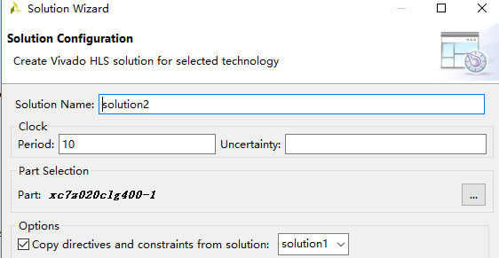
    

    

    <i>Creating a new Solution after copying the existing solution</i>
    

4-1-3. Make sure that the **yuv_filter.c** source is opened and visible in the information pane, and click on
the **Directive** tab.

4-1-4. Select function **yuv_scale** in the directives pane, right-click on it and select Insert Directive...

4-1-5. Click on the drop-down button of the Directive field. A pop-up menu shows up listing various
directives. Select **INLINE** directive.

4-1-6. In the Vivado HLS Directive Editor dialog box, click on the **off** option to turn OFF the automatic
inlining. Make sure that the Directive File is selected as destination. Click **OK**.
    

    
    

    

    <i>Turning OFF the inlining function</i>
    

* When an object (function or loop) is pipelined, all the loops below it, down through the hierarchy, will be automatically unrolled.
* In order for a loop to be unrolled it must have fixed bounds: all the loops in this design have variable bounds, defined by an input argument variable to the top-level function.
* Note that the TRIPCOUNT directive on the loops only influences reporting, it does not set bounds for synthesis.
* Neither the top-level function nor any of the sub-functions are pipelined in this example.
* The pipeline directive must be applied to the inner-most loop in each function – the innermost loops have no variable-bounded loops inside of them which are required to be unrolled and the outer loop will simply keep the inner loop fed with data

4-1-7. Expand the yuv_scale in the Directives tab, right-click on YUV_SCALE_LOOP_Y object and select insert directives …, and select **PIPELINE** as the directive.

4-1-8. Leave II (Initiation Interval) blank as Vivado HLS will try for an II=1, one new input every clock
cycle.

4-1-9. Click OK.

4-1-10. Similarly, apply the PIPELINE directive to YUV2RGB_LOOP_Y and RGB2YUV_LOOP_Y objects.
At this point, the Directive tab should look like as follows.
    

    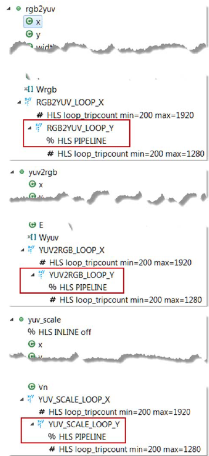
    

    

    <i>PIPELINE directive applied</i>
    

4-1-11. Click on the **Synthesis** button.

4-1-12. When the synthesis is completed, select **Project > Compare Reports…** to compare the two solutions

4-1-13. Select Solution1 and Solution2 from the **Available Reports**, and click on the **Add>> button**.

4-1-14. Observe that the latency reduced.
    

    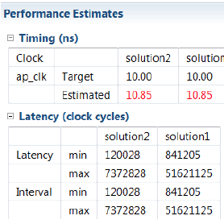
    

    

    <i>Performance comparison after pipelining</i>
    

In Solution1, the total loop latency of the inner-most loop was loop_body_latency x loop iteration
count, whereas in Solution2 the new total loop latency of the inner-most loop is
loop_body_latency + loop iteration count.

4-1-15. Scroll down in the comparison report to view the resources utilization. Observe that the FFs,
LUTs, and DSP48E utilization increased whereas BRAM remained same.
    

    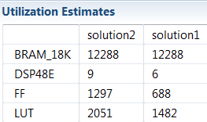
    

    

    <i>Resources utilization after pipelining</i>
    

### Apply DATAFLOW Directive and Configuration Command

#### 5-1. Create a new solution by copying the previous solution (Solution2) settings. Apply DATAFLOW directive. Generate the solution and understand the output.

5-1-1. Select **Project > New Solution** or click on button from the tools bar.

5-1-2. A Solution Configuration dialog box will appear. Click the **Finish** button (with copy from Solution2
selected).

5-1-3. Close all inactive solution windows by selecting **Project > Close Inactive Solution Tabs**.

5-1-4. Make sure that the yuv_filter.c source is opened in the information pane and select the Directive
tab.

5-1-5. Select function yuv_filter in the directives pane, right-click on it and select Insert Directive...

5-1-6. A pop-up menu shows up listing various directives. Select **DATAFLOW** directive and click OK.

5-1-7. Click on the **Synthesis** button.

5-1-8. When the synthesis is completed, the synthesis report is automatically opened.

5-1-9. Observe additional information, Dataflow Type, in the Performance Estimates section is
mentioned.
    

    
    

    

    <i>Performance estimate after DATAFLOW directive applied</i>
    

    
* The Dataflow pipeline throughput indicates the number of clocks cycles between each set of
inputs reads. If this throughput value is less than the design latency it indicates the design
can start processing new inputs before the currents input data are output.
* While the overall latencies haven’t changed significantly, the dataflow throughput is showing
that the design can achieve close to the theoretical limit (1920x1280 = 2457600) of
processing one pixel every clock cycle.    

5-1-10. Scrolling down into the Utilization Estimates, observe that the number of BRAMs required has
doubled. This is due to the default dataflow ping-pong buffering.
    

    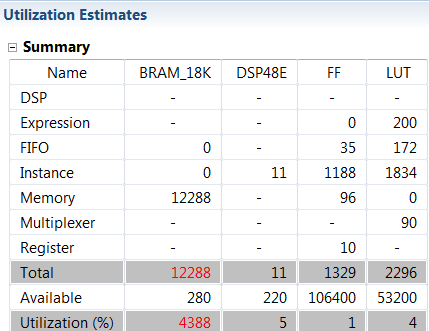
    

    

    <i>Resource estimate with DATAFLOW directive applied</i>
    

    
* When DATAFLOW optimization is performed, memory buffers are automatically inserted
between the functions to ensure the next function can begin operation before the previous
function has finished. The default memory buffers are ping-pong buffers sized to fully
accommodate the largest producer or consumer array.
* Vivado HLS allows the memory buffers to be the default ping-pong buffers or FIFOs. Since
this design has data accesses which are fully sequential, FIFOs can be used. Another
advantage to using FIFOs is that the size of the FIFOs can be directly controlled (not possible
in ping-pong buffers where random accesses are allowed).

5-1-11. The memory buffers type can be selected using Vivado HLS Configuration command.

#### 5-2. Apply Dataflow configuration command, generate the solution, and observe the improved resources utilization.

5-2-1. Select **Solution > Solution Settings…** to access the configuration command settings.

5-2-2. In the Configuration Settings dialog box, select **General** and click the **Add…** button.

5-2-3. Select config_dataflow as the command using the drop-down button and **fifo** as the
default_channel. Enter **2** as the fifo_depth. Click OK.
    

    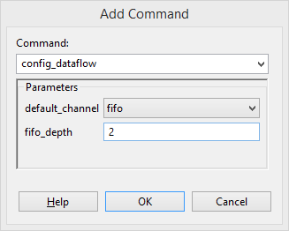
    

    

    <i>Selecting Dataflow configuration command and FIFO as buffer</i>
    

5-2-4. Click OK again.

5-2-5. Click on the Synthesis button.

5-2-6. When the synthesis is completed, the synthesis report is automatically opened.

5-2-7. Note that the performance parameter has not changed; however, resource estimates show that
the design is not using any BRAM and other resources (FF, LUT) usage has also reduced.
    

    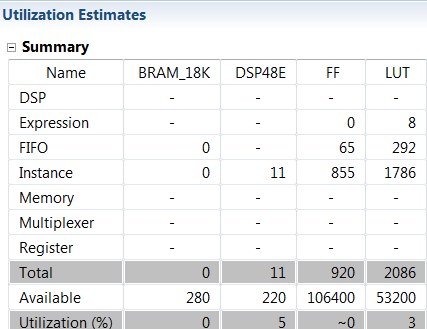
    

    

    <i>Resource estimation after Dataflow configuration command</i>
    

### Export and Implement the Design in Vivado HLS

#### 6-1. In Vivado HLS, export the design, selecting VHDL as a language, and run the implementation by selecting Evaluate option.

6-1-1. In Vivado HLS, select **Solution > Export RTL** or click on the button on tools bar to open the dialog box so the desired implementation can be run.

An Export RTL Dialog box will open.

6-1-2. Click on the drop-down button of the **Evaluate Generated RTL** field and select **VHDL** as the
language and click on the Vivado synthesis, place and route check box underneath.

6-1-3. Click OK and the implementation run will begin. You can observe the progress in the Vivado HLS
Console window. When the run is completed the implementation report will be displayed in the
information pane.
    

    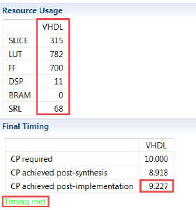
    

    

    <i>Implementation results in Vivado HLS</i>
    

6-1-4. Close Vivado HLS by selecting File > Exit.

## Conclusion

In this lab, you learned that even though this design could not be pipelined at the top-level, a strategy of
pipelining the individual loops and then using dataflow optimization to make the functions operate in
parallel was able to achieve the same high throughput, processing one pixel per clock. When
DATAFLOW directive is applied, the default memory buffers (of ping-pong type) are automatically
inserted between the functions. Using the fact that the design used only sequential (streaming) data
accesses allowed the costly memory buffers associated with dataflow optimization to be replaced with
simple 2 element FIFOs using the Dataflow command configuration.

### Answer

1. Answer the following questions for yuv_filter:

Estimated clock period: 10.85 ns 

Worst case latency: 51621125 

Number of DSP48E used: 6

Number of BRAMs used: 12288

Number of FFs used: 688 

Number of LUTs used: 1482 

2. Answer the following questions rgb2yuv:

Estimated clock period: 10.28 ns 

Worst case latency: 17207041 

Number of DSP48E used: 3

Number of FFs used: 203 

Number of LUTs used: 514 

3. Answer the following questions for yuv2rgb:

Estimated clock period: 10.85 ns 

Worst case latency: 19664641 

Number of DSP48E used: 3

Number of FFs used: 195 

Number of LUTs used: 438 

