# Improving Area and Resource Utilization Lab

## Introduction

This lab introduces various techniques and directives which can be used in Vivado HLS to improve
design performance as well as area and resource utilization. The design under consideration performs
discrete cosine transformation (DCT) on an 8x8 block of data.

## Objectives

After completing this lab, you will be able to:

* Add directives in your design
* Improve performance using PIPELINE directive
* Distinguish between DATAFLOW directive and Configuration Command functionality
* Apply memory partitions techniques to improve resource utilization

## Steps

### Validate the Design from Command Line

#### 1-1. Validate your design from Vivado HLS command line.

1-1-1. Launch Vivado HLS: Select **Start > All Programs > Xilinx Design Tools > Vivado 2018.2 > Vivado HLS > Vivado HLS 2018.2 Command Prompt**.

1-1-2. In the Vivado HLS Command Prompt, change directory to **c:\xup\hls\labs\lab3**.

1-1-3. A self-checking program (dct_test.c) is provided. Using that we can validate the design. A Makefile is also provided. Using the Makefile, the necessary source files can be compiled and the compiled program can be executed. In the Vivado HLS Command Prompt, type make to compile and execute the program.
    

    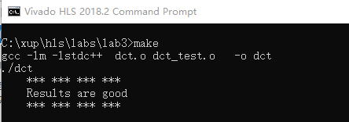
    

    

    <i>Figure 1. Validating the design</i>
    

Note that the source files (dct.c and dct_test.c are compiled, then dct executable program was
created, and then it was executed. The program tests the design and outputs Results are good
message.

1-1-4. Close the command prompt window by typing exit.

### Create a New Project

#### 2-1. Create a new project in Vivado HLS GUI targeting xc7z020clg400-1(pynq).

2-1-1. Launch Vivado HLS: **Select Start > All Programs > Xilinx Design Tools > Vivado 2018.2 >
Vivado HLS > Vivado HLS 2018.2**.

2-1-2. In the Vivado HLS GUI, select **File > New Project**. The New Vivado HLS Project wizard opens.

2-1-3. Click Browse… button of the Location field and browse to **c:\xup\hls\labs\lab3** and then click
OK.

2-1-4. For Project Name, type **dct.prj**.

2-1-5. Click Next.

2-1-6. In the Add/Remove Files for the source files, type dct as the function name (the provided source
file contains the function, to be synthesized, called dct).

2-1-7. Click the Add Files… button, select dct.c file from the **c:\xup\hls\labs\lab3** folder, and then click
Open.

2-1-8. Click Next.

2-1-9. In the Add/Remove Files for the testbench, click the **Add Files…** button, select **dct_test.c**, in.dat,
out.golden.dat files from the c:\xup\hls\labs\lab3 folder and click Open.

2-1-10. Click Next.

2-1-11. In the Solution Configuration page, leave Solution Name field as solution1 and set the clock
period as 10. Leave Uncertainty field blank.

2-1-12. Click on Part’s Browse button, and select the following filters, using the Parts Specify option, to
select xc7z020clg400-1.

2-1-13. Click Finish.

2-1-14. Double-click on the **dct.c** under the source folder to open its content in the information pane.
    

    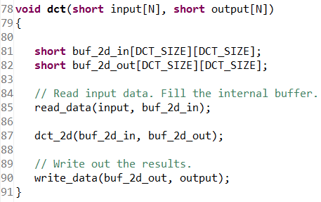
    

    

    <i>Figure 2. The design under consideration</i>
    

The top-level function dct, is defined at line 78. It implements 2D DCT algorithm by first
processing each row of the input array via a 1D DCT then processing the columns of the resulting
array through the same 1D DCT. It calls read_data, dct_2d, and write_data functions.

The read_data function is defined at line 54 and consists of two loops – RD_Loop_Row and
RD_Loop_Col. The write_data function is defined at line 66 and consists of two loops to perform
writing the result. The dct_2d function, defined at line 23, calls dct_1d function and performs
transpose.

Finally, dct_1d function, defined at line 4, uses dct_coeff_table and performs the required function
by implementing a basic iterative form of the 1D Type-II DCT algorithm. Following figure shows the function hierarchy on the left-hand side, the loops in the order they are executes and the flow
of data on the right-hand side.
    

    
    

    

    <i>Figure 3. Design hierarchy and dataflow</i>
    

### Synthesize the Design

#### 3-1. Synthesize the design with the defaults. View the synthesis results and answer the question listed in the detailed section of this step.

3-1-1. Select **Solution > Run C Synthesis > Active Solution** or click on the button on tools bar to start the
synthesis process.

3-1-2. When synthesis is completed, several report files will become accessible and the Synthesis
Results will be displayed in the information pane.

Note that the Synthesis Report section in the Explorer view only shows dct_1d.rpt, dct_2d.rpt,
and dct.rpt entries. The read_data and write_data functions reports are not listed. This is
because these two functions are inlined. Verify this by scrolling up into the Vivado HLS Console
view.
    

    
    

    

    <i>Figure 4. Inlining of read_data and write_data functions</i>
    

3-1-3. The Synthesis Report shows the performance and resource estimates as well as estimated
latency in the design. Note that the design is not optimized nor is pipelined.
    

    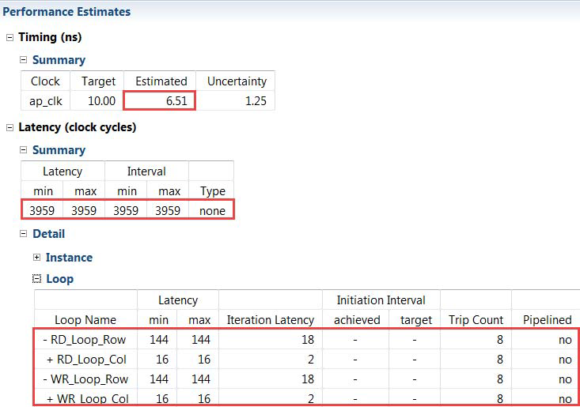
    

    

    <i>Figure 5.Synthesis report</i>
    
 
3-1-4. Using scroll bar on the right, scroll down into the report and answer the following question.

#### Question 1

Estimated clock period:

Worst case latency:

Number of DSP48E used:

Number of BRAMs used:

Number of FFs used:

Number of LUTs used:

3-1-5. The report also shows the top-level interface signals generated by the tools.
    

    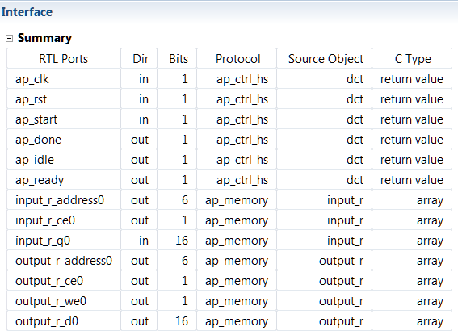
    

    

    <i>Figure 6. Generated interface signals</i>
    
 
You can see ap_clk, ap_rst are automatically added. The ap_start, ap_done, ap_idle, and
ap_ready are top-level signals used as handshaking signals to indicate when the design is able to
accept next computation command (ap_idle), when the next computation is started (ap_start),
and when the computation is completed (ap_done). The top-level function has input and output
arrays, hence an ap_memory interface is generated for each of them.

3-1-6. Open dct_1d.rpt and dct_2d.rpt files either using the Explorer view or by using a hyperlink at the
bottom of the dct.rpt in the information view. The report for dct_2d clearly indicates that most of
this design cycles (3668) are spent doing the row and column DCTs. Also the dct_1d report
indicates that the latency is 209 clock cycles ((24+2)*8+1).

### Run Co-Simulation

#### 4-1. Run the Co-simulation, selecting Verilog. Verify that the simulation passes.

4-1-1. Select **Solution > Run C/RTL Co-simulation** or click on the check mark button on tools bar to open the dialog box so
the desired simulations can be run.

A C/RTL Co-simulation Dialog box will open.

4-1-2. Select the Verilog option, and click OK to run the Verilog simulation using XSIM simulator.

The RTL Co-simulation will run, generating and compiling several files, and then simulating the
design. In the console window you can see the progress and also a message that the test is
passed.
    

    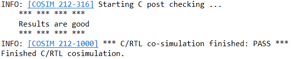
    

    

    <i>Figure 7. RTL Co-Simulation results</i>
    

    
### Apply PIPELINE Directive

#### 5-1. Create a new solution by copying the previous solution settings. Apply the PIPELINE directive to DCT_Inner_Loop, Xpose_Row_Inner_Loop, Xpose_Col_Inner_Loop, RD_Loop_Col, and WR_Loop_Col. Generate the solution and analyze the output.

5-1-1. Select **Project > New Solution** or click on the button from the tools bar buttons.

5-1-2. A Solution Configuration dialog box will appear. Click the **Finish** button (with copy from Solution1
selected).

5-1-3. Make sure that the **dct.c** source is opened in the information pane and click on the **Directive** tab.

5-1-4. Select **DCT_Inner_Loop** of the dct_1d function in the Directive pane, right-click on it and select
**Insert Directive**...

5-1-5. A pop-up menu shows up listing various directives. Select **PIPELINE** directive.

5-1-6. Leave II (Initiation Interval) blank as Vivado HLS will try for an II=1, one new input every clock
cycle.

5-1-7. Click OK.

5-1-8. Similarly, apply the **PIPELINE** directive to **Xpose_Row_Inner_Loop** and
**Xpose_Col_Inner_Loop** of the dct_2d function, and **RD_Loop_Col** of the read_data function,
and **WR_Loop_Col** of the write_data function. At this point, the Directive tab should look like as
follows.
    

    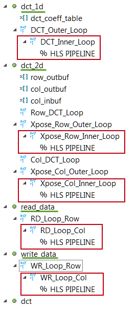
    

    

    <i>Figure 8. PIPELINE directive applied</i>
    

5-1-9. Click on the **Synthesis** button.

5-1-10. When the synthesis is completed, select **Project > Compare Reports…** to compare the two solutions.

5-1-11. Select Solution1 and Solution2 from the Available Reports, click on the Add>> button, and then
click OK.

5-1-12. Observe that the latency reduced from 3959 to 1851 clock cycles.
    

    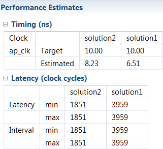
    

    

    <i>Figure 9. Performance comparison after pipelining</i>
    

5-1-13. Scroll down in the comparison report to view the resources utilization. Observe that the FFs
and/or LUTs utilization increased whereas BRAM and DSP48E remained same.
    

    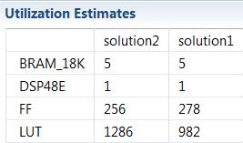
    

    

    <i>Figure 10. Resources utilization after pipelining</i>
    

#### 5-2. Open the Analysis perspective and determine where most of the clock cycles are spend, i.e. where the large latencies are.

5-2-1. Click on the Analysis perspective button.

5-2-2. In the Module Hierarchy, select the dct entry and observe the RD_Loop_Row_RD_Loop_Col and
WR_Loop_Row_WR_Loop_Col entries. These are two nested loops flattened and given the new
names formed by appending inner loop name to the ouer loop name. You can also verify this by
looking in the Console view message.
    

    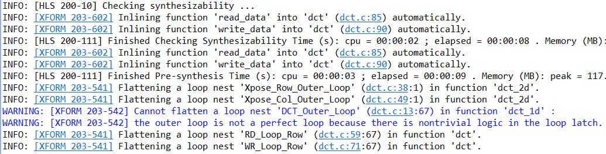
    

    

    <i>Figure 11. The console view content indicating loops flattening</i>
    

    

    
    

    

    <i>Figure 12. The performance profile at the dct function level</i>
    

5-2-3. In the Module Hierarchy tab, expand **dct > dct_2d**. Notice that the most of the latency occurs is
in dct_2d function.

5-2-4. In the Module Hierarchy tab, notice that there still hierarchy exists in the dct_2d module. Expand
**dct > dct_2d > dct 12d**, and select the dct_1d entry.
    

    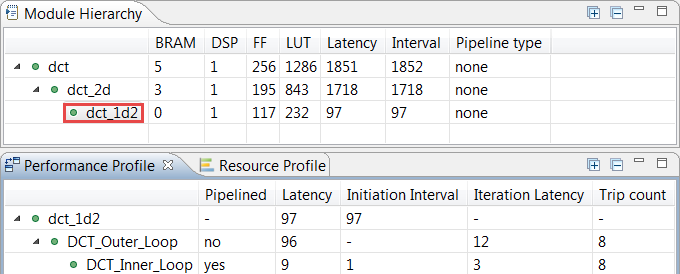
    

    

    <i>Figure 13. The dct_1d function performance profile</i>
    

5-2-5. In the Performance Profile tab, select the DCT_Inner_Loop entry, right-click on the node_60
(write) block in the C3 state in the Performance view, and select Goto Source. Notice that line 19
is highlighted which is preventing the flattening of the DCT_Outer_Loop.
    

    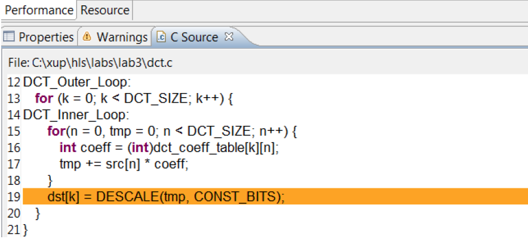
    

    

    <i>Figure 14. Understanding what is preventing DCT_Outer_Loop flattening</i>
    

5-2-6. Switch to the Synthesis perspective.

### 5-3. Create a new solution by copying the previous solution settings. Apply fine-grain parallelism of performing multiply and add operations of the inner loop of dct_1d using PIPELINE directive by moving the PIPELINE directive from inner loop to the outer loop of dct_1d. Generate the solution and analyze the output.

5-3-1. Select **Project > New Solution**.

5-3-2. A Solution Configuration dialog box will appear. Click the **Finish** button (with Solution2 selected).

5-3-3. Select PIPELINE directive of **DCT_Inner_Loop** of the dct_1d function in the Directive pane,
right-click on it and select **Remove** Directive.

5-3-4. Select **DCT_Outer_Loop** of the dct_1d function in the Directive pane, right-click on it and select
Insert Directive...

5-3-5. A pop-up menu shows up listing various directives. Select **PIPELINE** directive.

5-3-6. Click **OK**.
    

    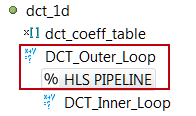
    

    

    <i>Figure 15. PIPELINE directive applied to DCT_Outer_Loop</i>
    

By pipelining an outer loop, all inner loops will be unrolled automatically (if legal), so there is no
need to explicitly apply an UNROLL directive to DCT_Inner_Loop. Simply move the pipeline to
the outer loop: the nested loop will still be pipelined but the operations in the inner-loop body will
operate concurrently.

5-3-7. Click on the **Synthesis** button.

5-3-8. When the synthesis is completed, select **Project > Compare Reports…** to compare the two
solutions.

5-3-9. Select Solution2 and Solution3 from the **Available Reports**, click on the **Add>>** button, and then
click OK.

5-3-10. Observe that the latency reduced from 1851 to 875 clock cycles.
    

    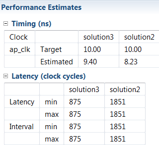
    

    

    <i>Figure 16. Performance comparison after pipelining</i>
    

    
5-3-11. Scroll down in the comparison report to view the resources utilization. Observe that the utilization
of all resources (except BRAM) increased. Since the DCT_Inner_Loop was unrolled, the parallel
computation requires 8 DSP48E.
    

    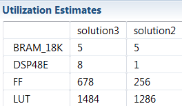
    

    

    <i>Figure 17. Resources utilization after pipelining</i>
    

5-3-12. Open dct_1d report and observe that the pipeline initiation interval (II) is four (4) cycles, not one
(1) as might be hoped and there are now 8 BRAMs being used for the coefficient table.

Looking closely at the synthesis log, notice that the coefficient table was automatically partitioned,
resulting in 8 separate ROMs: this helped reduce the latency by keeping the unrolled computation
loop fed, however the input arrays to the dct_1d function were not automatically partitioned.

The reason the II is four (4) rather than the eight (8) one might expect, is because Vivado HLS
automatically uses dual-port RAMs, when beneficial to scheduling operations.
    

    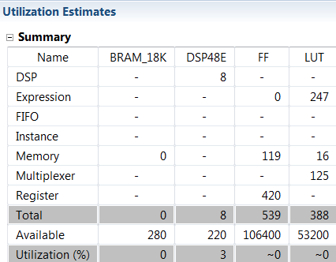
    

    

    <i>Figure 18. Increased resource utilization of dct_1d</i>
    

    

    
    

    

    <i>Figure 19. Automatic partitioning of dct_coeff_table</i>
    

    

    
    

    

    <i>Figure 20. Initiation interval of 4</i>
    

#### 5-4. Perform design analysis by switching to the Analysis perspective and looking at the dct_1d performance view.

5-4-1. Switch to the Analysis perspective, expand the Module Hierarchy entries, and select the dct_1d
entry.

5-4-2. Expand, if necessary, the **Profile** tab entries and notice that the DCT_Outer_Loop is now
pipelined and there is no DCT_Inner_Loop entry.
    

    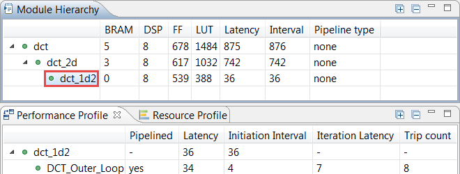
    

    

    <i>Figure 21. DCT_Outer_Loop flattening</i>
    

5-4-3. Select the dct_1d entry in the Module Hierarchy tab and observe that the DCT_Outer_Loop
spans over eight states in the Performance view.
    

    
    

    

    <i>Figure 22. The Performance view of the DCT_Outer_Loop function</i>
    

5-4-4. Switch to the Synthesis perspective.

### Improve Memory Bandwidth

#### 6-1. Create a new solution by copying the previous solution (Solution3) settings. Apply ARRAY_PARTITION directive to buf_2d_in of dct (since the bottleneck was on src port of the dct_1d function, which was passed via in_block of the dct_2d function, which in turn was passed via buf_2d_in of the dct function) and col_inbuf of dct_2d. Generate the solution.

6-1-1. Select **Project > New Solution** to create a new solution.

6-1-2. A Solution Configuration dialog box will appear. Click the Finish button (with Solution3 selected).

6-1-3. With dct.c open, select buf_2d_in array of the dct function in the Directive pane, right-click on it
and select Insert Directive...

The buf_2d_in array is selected since the bottleneck was on src port of the dct_1d function, which
was passed via in_block of the dct_2d function, which in turn was passed via buf_2d_in of the dct
function).

6-1-4. A pop-up menu shows up listing various directives. Select **ARRAY_PARTITION** directive.

6-1-5. Make sure that the type is complete. Enter **2** in the dimension field and click OK.
    

    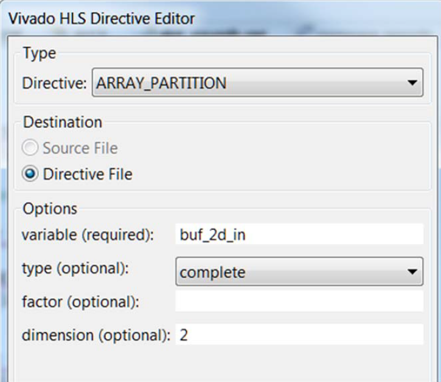
    

    

    <i>Figure 23. Applying ARRAY_PARTITION directive to memory buffer</i>
    

6-1-6. Similarly, apply the ARRAY_PARTITION directive with dimension of 2 to the **col_inbuf** array.

6-1-7. Click on the **Synthesis** button.

6-1-8. When the synthesis is completed, select **Project > Compare Reports…** to compare the two
solutions.

6-1-9. Select Solution3 and Solution4 from the Available Reports, and click on the **Add>>** button.

6-1-10. Observe that the latency reduced from 875 to 509 clock cycles.
    

    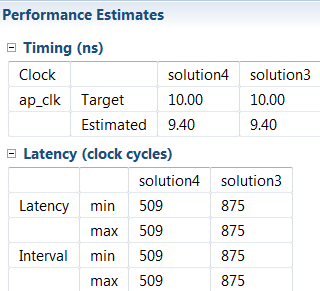
    

    

    <i>Figure 24. Performance comparison after array partitioning</i>
    

6-1-11. Scroll down in the comparison report to view the resources utilization. Observe the increase in
the FF resource utilization (almost double).
    

    
    

    

    <i>Figure 25. Resources utilization after array partitioning</i>
    

6-1-12. Expand the Loop entry in the **dct.rpt** entry and observe that the Pipeline II is now 1.

#### 6-2. Perform resource analysis by switching to the Analysis perspective and looking at the dct resources profile view.

6-2-1. Switch to the Analysis perspective, expand the Module Hierarchy entries, and select the dct entry.

6-2-2. Select the **Resource Profile** tab.

6-2-3. Expand the Memories and Expressions entries and observe that the most of the resources are
consumed by instances. The buf_2d_in array is partitioned into multiple memories and most of
the operations are done in addition and comparison.
    

    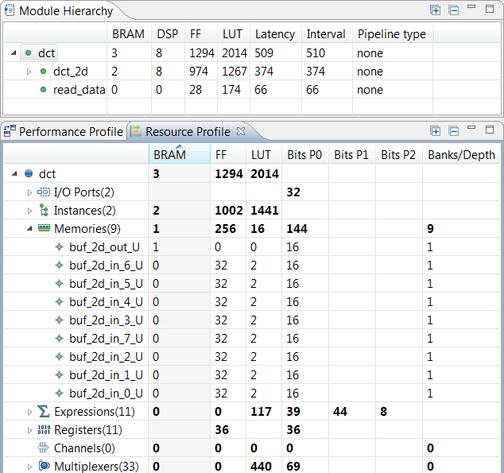
    

    

    <i>Figure 26. Resource profile after partitioning buffers</i>
    

6-2-4. Switch to the Synthesis perspective.

### Apply DATAFLOW Directive

#### 7-1. Create a new solution by copying the previous solution (Solution4) settings. Apply the DATAFLOW directive to improve the throughput. Generate the solution and analyze the output.

7-1-1. Select Project > New Solution.

7-1-2. A Solution Configuration dialog box will appear. Click the Finish button (with Solution4 selected).

7-1-3. Close all inactive solution windows by selecting **Project > Close Inactive Solution** Tabs.

7-1-4. Select function dct in the directives pane, right-click on it and select Insert Directive...

7-1-5. Select **DATAFLOW** directive to improve the throughput.

7-1-6. Click on the **Synthesis** button.

7-1-7. When the synthesis is completed, the synthesis report is automatically opened.

7-1-8. Observe that dataflow type pipeline throughput is listed in the Performance Estimates
    

    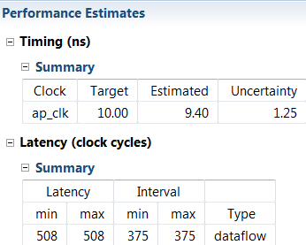
    

    

    <i>Figure 27. Performance estimate after DATAFLOW directive applied</i>
    

* The Dataflow pipeline throughput indicates the number of clock cycles between each set of
inputs reads (interval parameter). If this value is less than the design latency it indicates the
design can start processing new inputs before the currents input data are output.
* Note that the dataflow is only supported for the functions and loops at the top-level, not those
which are down through the design hierarchy. Only loops and functions exposed at the toplevel
of the design will get benefit from dataflow optimization.

7-1-9. Scrolling down into the Area Estimates, observe that the number of BRAM_18K required at the
top-level remained at 3.
    

    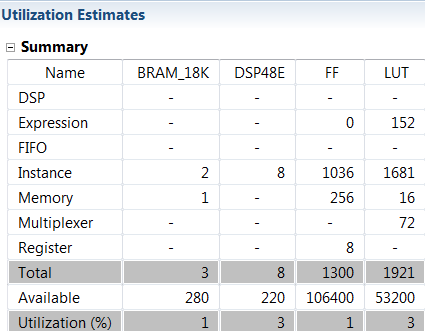
    

    

    <i>Figure 28. Resource estimate with DATAFLOW directive applied</i>
    

7-1-10. Look at the console view and notice that dct_coeff_table is automatically partitioned in dimension
2. The buf_2d_in and col_inbuf arrays are partitioned as we had applied the directive in the
previous run. The dataflow is applied at the top-level which created channels between top-level
functions read_data, dct_2d, and write_data.
    

    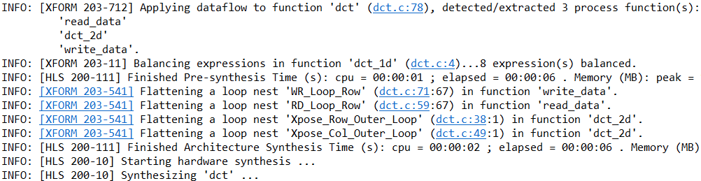
    

    

    <i>Figure 29. Console view of synthesis process after DATAFLOW directive applied</i>
    

#### 7-2. Perform performance analysis by switching to the Analysis perspective and looking at the dct performance profile view.

7-2-1. Switch to the Analysis perspective, expand the Module Hierarchy entries, and select the dct_2d
entry.

7-2-2. Select the Performance Profile tab.

Observe that most of the latency and interval (throughput) is caused by the dct_2d function. The
interval of the top-level function dct, is less than the sum of the intervals of the read_data, dct_2d,
and write_data functions indicating that they operate in parallel and dct_2d is the limiting factor.
From the Performance Profile tab it can be seen that dct_2d is not completely operating in
parallel as Row_DCT_Loop and Col_DCT_Loop were not pipelined.
    

    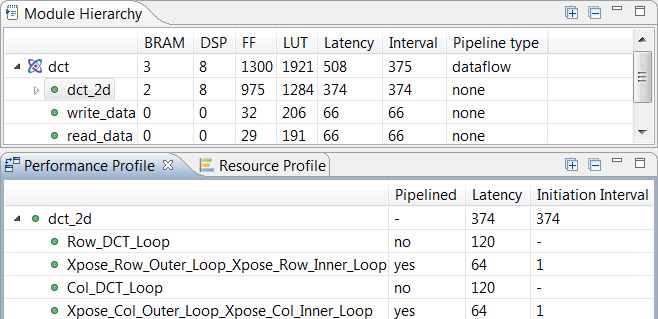
    

    

    <i>Figure 30. Performance analysis after the DATAFLOW directive</i>
    

One of the limitations of the dataflow optimization is that it only works on top-level loops and
functions. One way to have the blocks in dct_2d operate in parallel would be to pipeline the entire
function. This however would unroll all the loops and can sometimes lead to a large area increase.
An alternative is to raise these loops up to the top-level of hierarchy, where dataflow optimization
can be applied, by removing the dct_2d hierarchy, i.e. inline the dct_2d function.

7-2-3. Switch to the Synthesis perspective.

### Apply INLINE Directive

#### 8-1. Create a new solution by copying the previous solution (Solution5) settings. Apply INLINE directive to dct_2d. Generate the solution and analyze the output.

8-1-1. Select Project > New Solution.

8-1-2. A Solution Configuration dialog box will appear. Click the Finish button (with Solution5 selected).

8-1-3. Select the function **dct_2d** in the directives pane, right-click on it and select Insert Directive...

8-1-4. A pop-up menu shows up listing various directives. Select **INLINE** directive.

The INLINE directive causes the function to which it is applied to be inlined: its hierarchy is
dissolved.

8-1-5. Click on the **Synthesis** button.

8-1-6. When the synthesis is completed, the synthesis report will be opened.

8-1-7. Observe that the latency reduced from 508 to 495 clock cycles, and the Dataflow pipeline throughput drastically reduced from 375 to 114 clock cycles.

8-1-8. Examine the synthesis log to see what transformations were applied automatically.

* The dct_1d function calls are now automatically inlined into the loops from which they are
called, which allows the loop nesting to be flattened automatically.
* Note also that the DSP48E usage has doubled (from 8 to 16). This is because, previously a
single instance of dct_1d was used to do both row and column processing; now that the row
and column loops are executing concurrently, this can no longer be the case and two copies
of dct_1d are required: Vivado HLS will seek to minimize the number of clocks, even if it
means increasing the area.
* BRAM usage has increased once again (from 4 to 6), due to ping-pong buffering between
more dataflow processes.
    

    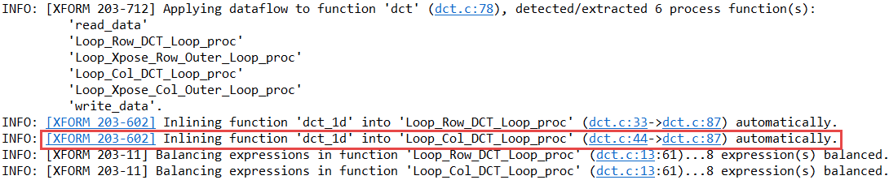
    

    

    <i>Figure 31. Console view after INLINE directive applied to dct_2d</i>
    
   

8-1-9. Switch to the Analysis perspective, expand the Module Hierarchy entries, and select the dct entry.

Observe that the dct_2d entry is now replaced with dct_Loop_Row_DCT_Loop_proc,
dct_Loop_Xpose_Row_Outer_Loop_proc, dct_Loop_Col_DCT_Loop_proc, and
dct_Loop_Xpose_Col_Outer_Loop_proc since the dct_2d function is inlined. Also observe that all
the functions are operating in parallel, yielding the top-level function interval (throughput) of 106
clock cycles.
    

    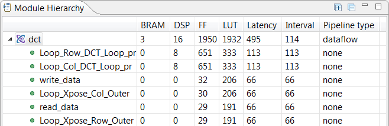
    

    

    <i>Figure 32.  Performance analysis after the INLINE directive</i>
    
 

8-1-10. Switch to the Synthesis perspective.

### Apply RESHAPE Directive

#### 9-1. Create a new solution by copying the previous solution (Solution6) settings. Apply the RESHAPE directive. Generate the solution and understand the output.

9-1-1. Select **Project > New Solution**.

9-1-2. A Solution Configuration dialog box will appear. Click the Finish button (with Solution6 selected).

9-1-3. Select **PARTITION** directive applied to the buf_2d_in array of the dct function in the Directive
pane, right-click, and select **Modify Directive**. Select **ARRAY_RESHAPE** directive, enter **2** as
the dimension, and click OK.

9-1-4. Similarly, change PARTITION directive applied to the col_inbuf array of the dct_2d function in
the Directive pane, to ARRAY_RESHAPE with the dimension of 2.

9-1-5. Assign the **ARRAY_RESHAPE** directive with dimension of 2 to the **dct_coeff_table** array.
    

    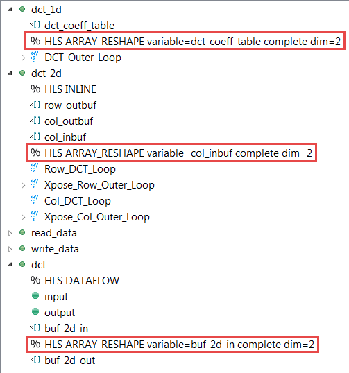
    

    

    <i>Figure 33. RESHAPE directive applied</i>
    
 

9-1-6. Click on the Synthesis button.

9-1-7. When the synthesis is completed, the synthesis report is automatically opened.

9-1-8. Observe that both latency and Dataflow pipeline throughput has regressed. The BRAM resource utilization increased from 3 to 7.

* Reviewing the synthesis log will provide some clues. There are warnings in the scheduling
phase for read_data stating that II=1 could not be achieved. In fact, read_data complains
about the conflict of read and write operations.
* The problem here is due to the fact that an update to a single element in a reshaped array
requires that the entire word be read, the single element updated and the entire word written
back: an array that has been reshaped requires a read-modify-write cycle (Vivado HLS does
not implement byte-masking on writes).
* This operation negatively impacts the maximum write bandwidth for such an array.

9-1-9. Thus it can be seen the directives have to be applied carefully.

9-1-10. Close Vivado HLS by selecting File > Exit.

## Conclusion

In this lab, you learned various techniques to improve the performance and balance resource utilization.
PIPELINE directive when applied to outer loop will automatically cause the inner loop to unroll. When a
loop is unrolled, resources utilization increases as operations are done concurrently. Partitioning memory
may improve performance but will increase BRAM utilization. When INLINE directive is applied to a
function, the lower level hierarchy is automatically dissolved. When DATAFLOW directive is applied, the
default memory buffers (of ping-pong type) are automatically inserted between the top-level functions and
loops. The RESHAPE directive will allow multiple accesses to BRAM, however, care should be taken if a
single element requires modification as it will result in read-modify-write operation for the entire word. The
Analysis perspective and console logs can provide insight on what is going on.

#### Answers

1. Answer the following questions for dct:

Estimated clock period: 6.51 ns

Worst case latency: 3959 clock cycles

Number of DSP48E used: 1

Number of BRAMs used: 5

Number of FFs used: 278

Number of LUTs used: 982
