# Creating a Processor System Lab

## Introduction

This lab introduces a design flow to generate a IP-XACT adapter from a design using Vivado HLS and
using the generated IP-XACT adapter in a processor system using IP Integrator in Vivado.

## Objectives

After completing this lab, you will be able to:

* Understand the steps and directives involved in creating an IP-XACT adapter from a synthesized
design in Vivado HLS
* Create a processor system using IP Integrator in Vivado
* Integrate the generated IP-XACT adapter into the created processor system

## The design

The design consists of a FIR filter to filter a 4 KHz tone added to CD quality (48 KHz) music. The
characteristic of the filter is as follows:

FS=48000 Hz

FPASS1=2000 Hz

FSTOP1=3800 Hz

FSTOP2=4200 Hz

FPASS2=6000 Hz

APASS1=APASS2=1 dB

ASTOP=60 dB

This lab requires you to develop a peripheral core of the designed filter that can be instantiated in a
processor system. The processor system will acquire a stereo music stream using an on-board CODEC
chip and I2C controller, process it through the designed filter (bandstop filter), and output back to the
headphone.

## Steps

### Create a New Project 

#### 1-1. Create a new project in Vivado HLS targeting xc7z020clg400-1(pynq)

1-1-1. Launch Vivado HLS: **Select Start > All Programs > Xilinx Design Tools > Vivado 2018.2 >
Vivado HLS > Vivado HLS 2018.2**

A Getting Started GUI will appear.

1-1-2. In the Getting Started section, click on Create New Project. The New Vivado HLS Project wizard
opens.

1-1-3. Click Browse… button of the Location field, browse to **c:\xup\hls\labs\lab4**, and then click OK.

1-1-4. For Project Name, type fir.prj

1-1-5. Click Next.

1-1-6. In the Add/Remove Files for the source files, type **fir** as the function name (the provided source
file contains the function, to be synthesized, called fir).

1-1-7. Click the Add Files… button, select **fir.c** and **fir_coef.dat** files from the c:\xup\hls\labs\lab4 folder,
and then click Open.

1-1-8. Click Next.

1-1-9. In the Add/Remove Files for the testbench, click the Add Files… button, select **fir_test.c** file from
the c:\xup\hls\labs\lab4 folder and click Open.

1-1-10. Click Next.

1-1-11. In the Solution Configuration page, leave Solution Name field as solution1 and set the clock
period as 10. Leave Uncertainty field blank.

1-1-12. Click on Part’s Browse button, and select the following filters, using the Parts Specify option, to
select xc7z020clg400-1.

1-1-13. Click Finish.

You will see the created project in the Explorer view. Expand various sub-folders to see the
entries under each sub-folder.

1-1-14. Double-click on the fir.c under the source folder to open its content in the information pane.
    

    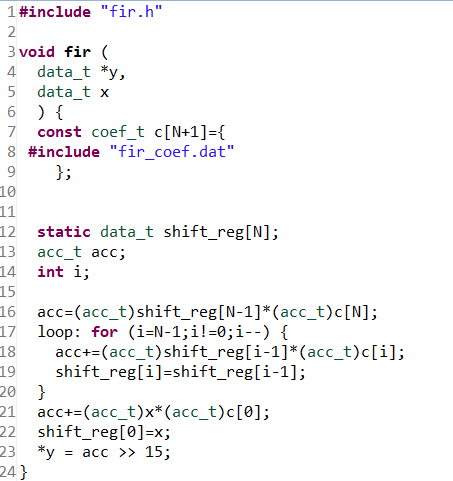
    

    

    <i>The design under consideration</i>
    

The FIR filter expects x as a sample input and pointer to the computed sample out. Both of them
are defined of data type data_t. The coefficients are loaded in array c of type coef_t from the file
called fir_coef.dat located in the current directory. The sequential algorithm is applied and
accumulated value (sample out) is computed in variable acc of type acc_t.

1-1-15. Double-click on the **fir.h** in the outline tab to open its content in the information pane.
    

    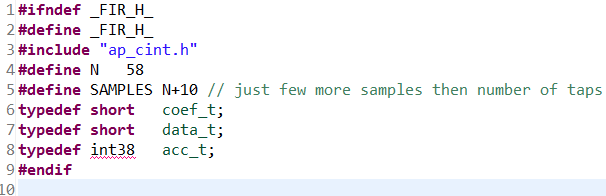
    

    

    <i>The header file</i>
    

    
The header file includes ap_cint.h so user defined data width (of arbitrary precision) can be used.
It also defines number of taps (N), number of samples to be generated (in the testbench), and
data types coef_t, data_t, and acc_t. The coef_t and data_t are short (16 bits). Since the
algorithm iterates (multiply and accumulate) over 59 taps, there is a possibility of bit growth of 6
bits and hence acc_t is defined as int38. Since the acc_t is bigger than sample and coefficient
width, they have to cast before being used (like in lines 16, 18, and 21 of fir.c).

1-1-16. Double-click on the **fir_test.c** under the testbench folder to open its content in the information
pane.

Notice that the testbench opens fir_impulse.dat in write mode, and sends an impulse (first sample
being 0x8000.

### Run C Simulation

#### 2-1. Run C simulation to observe the expected output.

2-1-1. Select **Project > Run C Simulation** or click on the button from the tools bar buttons, and Click OK in
the C Simulation Dialog window.

The testbench will be compiled using apcc compiler and csim.exe file will be generated. The
csim.exe will then be executed and the output will be displayed in the console view.
    

    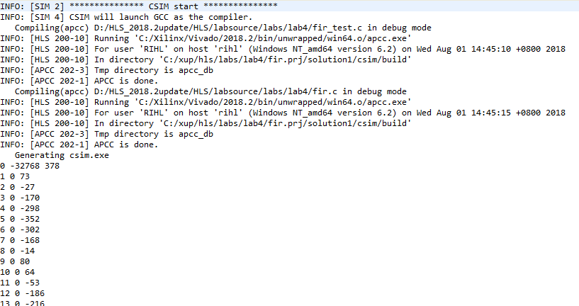
    

    

    <i>Initial part of the generated output in the Console view</i>
    

You should see the filter coefficients being computed.

### Synthesize the Design

#### 3-1. Synthesize the design with the defaults. View the synthesis results and answer the question listed in the detailed section of this step.

3-1-1. Select **Solution > Run C Synthesis > Active Solution** to start the synthesis process.

3-1-2. When synthesis is completed, several report files will become accessible and the Synthesis
Results will be displayed in the information pane.

3-1-3. The Synthesis Report shows the performance and resource estimates as well as estimated
latency in the design.

3-1-4. Using scroll bar on the right, scroll down into the report and answer the following question.

#### Question 1

Estimated clock period:

Worst case latency:

Number of DSP48E used:

Number of BRAMs used:

Number of FFs used:

Number of LUTs used:

3-1-5. The report also shows the top-level interface signals generated by the tools.
    

    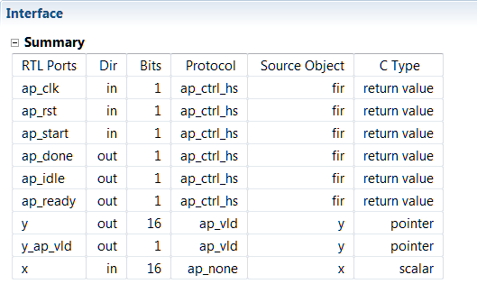
    

    

    <i>Generated interface signals</i>
    

You can see the design expects x input as 16-bit scalar and outputs y via pointer of the 16-bit
data. It also has ap_vld signal to indicate when the result is valid.

#### 3-2. Add PIPELINE directive to loop and re-synthesize the design. View the synthesis results.

3-2-1. Make sure that the fir.c is open in the information view.

3-2-2. Select the **Directive** tab, and apply the **PIPELINE** directive to the loop.

3-2-3. Select Solution > Run C Synthesis > Active Solution to start the synthesis process.

3-2-4. When synthesis is completed, the Synthesis Results will be displayed in the information pane.

3-2-5. Note that the latency has reduced to 62 or 63 clock cycles. The DSP48 and BRAM consumption
remains same; however, LUT and FF consumptions have slightly increased.

### Run RTL/C CoSimulation

#### 4-1. Run the RTL/C Co-simulation, selecting Verilog. Verify that the simulation passes.

4-1-1. Select **Solution > Run C/RTL Co-simulation** or click on the button to open the dialog box
so the desired simulations can be run.

A C/RTL Co-simulation Dialog box will open.

4-1-2. Select the Verilog option and click OK.

The Co-simulation will run, generating and compiling several files, and then simulating the design.
In the console window you can see the progress. When done the RTL Simulation Report shows
that it was successful and the latency reported was 62.

### Setup IP-XACT Adapter

#### 5-1. Add INTERFACE directive to create AXI4LiteS adapters so IP-XACT adapter can be generated during the RTL Export step.

5-1-1. Make sure that **fir.c** file is open and in focus in the information view.

5-1-2. Select the Directive tab.

5-1-3. Right-click **x**, and click on Insert Directive….

5-1-4. In the Vivado HLS Directive Editor dialog box, select **INTERFACE** using the drop-down button.

5-1-5. Click on the button beside mode (optional). Select **s_axilite**.

5-1-6. In the bundle (optional) field, enter **fir_io** and click OK.
    

    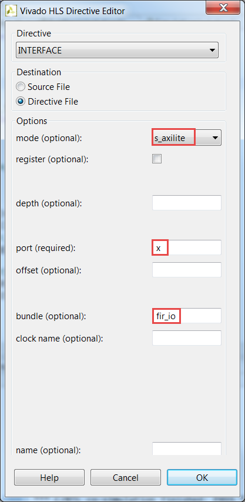
    

    

    <i>Selecting the AXI4LiteS adapter and naming bundle</i>
    

5-1-7. Similarly, apply the INTERFACE directive (including bundle) to the **y** output.
    

    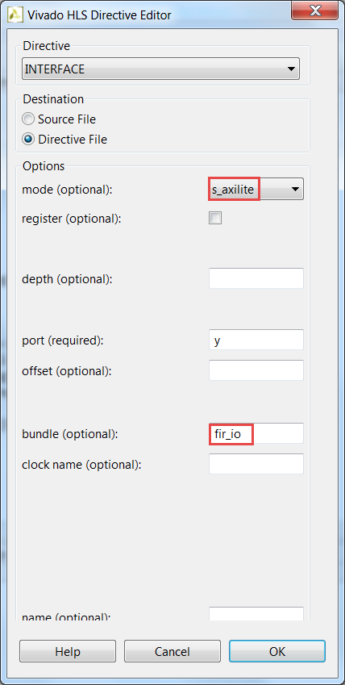
    

    

    <i>Applying bundle to assign y output to AXI4Lite adapter</i>
    

5-1-8. Apply the INTERFACE directive to the **top-level module fir** to include ap_start, ap_done, and
ap_idle signals as part of bus adapter (the variable name shown will be return). Include the
bundle information too.
    

    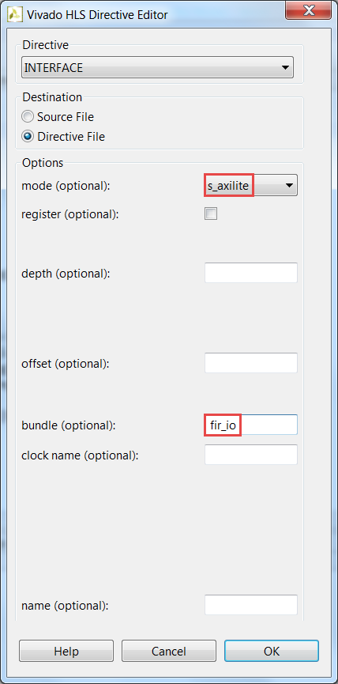
    

    

    <i>Applying bundle to assign function control signals to AXI4Lite adapter</i>
    

Note that the above steps 5-1-3 through 5-1-8 will create address maps for x, y, ap_start ap_valid,
ap_done, and ap_idle, which can be accessed via software. Alternately, ap_start, ap_valid,
ap_done, ap_idle signals can be generated as separate ports on the core by not applying
RESOURCE directive to the top-level module fir. These ports will then have to be connected in a
processor system using available GPIO IP.

### Generate IP-XACT Adapter

#### 6-1. Re-synthesize the design as directives have been added. Run the RTL Export to generate the IP-XACT adapter.

6-1-1. Since the directives have been added, it is safe to re-synthesize the design. Select **Solution >
Run C Synthesis > Active Solution**

Check the Interface summary at the bottom of the Synthesis report to see the interface that has
been created.

6-1-2. Once the design is synthesized, select **Solution > Export RTL** to open the dialog box so the
desired IP can be generated.

An Export RTL Dialog box will open.
    

    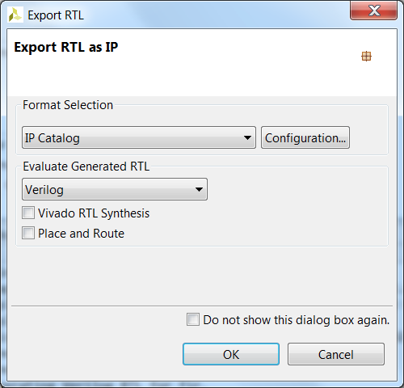
    

    

    <i>Export RTL Dialog</i>
    

6-1-3. Click OK to generate the IP-XACT adapter.

6-1-4. When the run is completed, expand the **impl** folder in the Explorer view and observe various
generated directories; ip, misc, verilog and vhdl.
    

    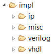
    

    

    <i>IP-XACT adapter generated</i>
    

Expand the ip directory and observe several files and sub-directories. One of the sub-directory of
interest is the drivers directory which consists of header, c, tcl, mdd, and makefile files. Another
file of interest is the zip file, which is the ip repository file that can be imported in an IP Integrator
design
    

    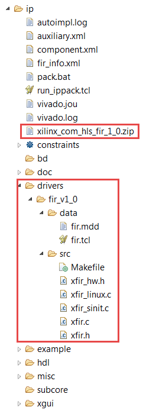
    

    

    <i>Adapter’s drivers directory</i>
    

6-1-5. Close Vivado HLS by selecting File > Exit.

### Create a Vivado Project

#### 7-1. Launch Vivado Tcl Shell and run the provided tcl script to create an initial system targeting the Pynq board.

7-1-1. Open Vivado Tcl Shell by selecting Start > All Programs > Xilinx Design Tools > Vivado
2018.2 > Vivado 2018.2 Tcl Shell

7-1-2. In the shell window, change the directory to c:/xup/hls/labs/lab4 using the cd account.

7-1-3. Run the project by double clicking on the pynq_block_audio.xpr in pynq_block_audio folder.
    

    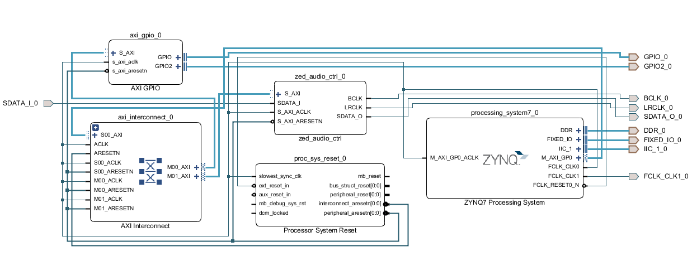
    

    

    <i>Block design made for Pynq</i>
    

#### 7-2. Add the HLS IP to the IP Catalog

7-2-1. In the Flow Navigator pane, click Settings under Project Manager.

7-2-2. Expand **IP > Repository** in the left pane.

7-2-3. Click the + button (The lab4/ip_repo directory has already been added). Browse to
c:\xup\hls\labs\lab4\fir.prj\solution1\impl\ip and click Select.

The directory will be scanned and added in the IP Repositories window, and one IP entry will be
detected.

7-2-4. Click OK.
    

    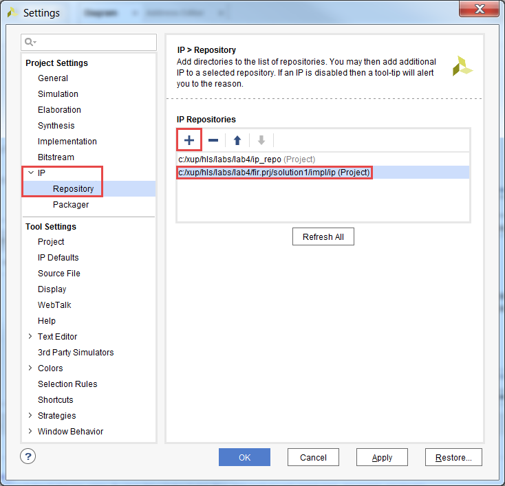
    

    

    <i>Setting path to IP Repositories</i>
    

7-2-5. Click OK to accept the settings

#### 7-3. Instantiate fir_top core twice, one for each side channel, into the processing system naming the instances as fir_left and fir_right.

7-3-1. Click the Add IP icon (plus sign icon) and search for Fir in the catalog by typing Fir and double-click on the
Fir entry to add an instance.

Notice that the added IP has HLS logo in it indicating that this was created by Vivado HLS.

7-3-2. Select the added instance in the diagram, and change its instance name to fir_left by typing it in
the Name field of the Block Properties form in the left.

7-3-3. Similarly, add another instance of the HLS IP, and name it fir_right.

7-3-4. Click on **Run Connection Automation**, and select **All Automation**.

7-3-5. Click on /fir_left/s_axi_fir_io, and /fir_right/ s_axi_fir_io and verify that they will both be
connected to the M_AXI_GP0, and click OK.

#### 7-4. Enable the PS-PL Interrupt ports > IRQ_F2P ports. Add an instance of concat IP with two single-bit input ports. Connect input ports to the interrupt ports of the two FIR instances and the output port to the IRQ_F2P port of the processing_system7_0 instance.

7-4-1. Double-click on the processing_system7_0 instance to open the re-customization form.

7-4-2. Select the Interrupt in the left pane, click on the Fabric Interrupts check box in the right.

7-4-3. Expand the Fabric Interrupts > PL-PS Interrupt Ports > IRQ_F2P entry in the right, and click the
check-box of IRQ_F2P[15:0].

7-4-4. Click OK.

7-4-5. Add an instance of the concat IP.

7-4-6. Connect the interrupt port of each of the FIR instances to the two input ports of the xlconcat_0
instance.

7-4-7. Connect the output port of the xlconcat_0 instance to the IRQ_F2P port of the
processing_system7_0 instance.

At this stage the design should look like shown below (you may have to click the regenerate
button).
    

    
    

    

    <i>The complete hardware design</i>
    

#### 7-5. Verify addresses and validate the design. Generate the system_wrapper file, and add the provided Xilinx Design Constraints (XDC).

7-5-1. Click on the **Address Editor**, and expand the processing_system7_0 > Data if necessary.

The generated address map should look like as shown below.
    

    
    

    

    <i>Generated address map</i>
    

7-5-2. Run Design Validation (Tools > **Validate Design**) and verify there are no errors

7-5-3. In the sources view, right-click on the block diagram file, system.bd, and select Create HDL
Wrapper to update the HDL wrapper file. When prompted, click OK with the Let Vivado manage
wrapper and auto-update option.

7-5-4. Click Add Sources in the Flow Navigator pane, select **Add or Create Constraints**, and click
Next.

7-5-5. Click the Add Files button, browse to the c:\xup\hls\labs\lab4 folder, select **audio_constraints.xdc**.

7-5-6. Click Copy constraints files into project and then click Finish to add the file.

7-5-7. Click on the Generate Bitstream in the Flow Navigator to run the synthesis, implementation, and
bitstream generation processes.

7-5-8. Click Save, Yes, and OK if prompted to start the process.

7-5-9. When the bit generation is completed, a selection box will be displayed with Open Implemented
Design option selected. Click **Cancel**.

### Export to SDK and create Application Project

#### 8-1. Export the hardware along with the generated bitstream to SDK.

8-1-1. Select File > Export > Export Hardware…

8-1-2. Make sure that Include Bitstream option is selected and click OK, leaving the target directory set
to local project directory.

8-1-3. Select File > Launch SDK

8-1-4. Click OK.

8-1-5. In SDK, select File > New > Board Support Package.

8-1-6. Click Finish with the default settings (with standalone operating system).

This will open the Software Platform Settings form showing the OS and libraries selections.

8-1-7. Click OK to accept the default settings, as we want to create a standalone_bsp_0 software
platform project without requiring any additional libraries support.

The library generator will run in the background and will create xparameters.h file in the
C:\xup\hls\labs\lab4\audio\audio.sdk\standalone_bsp_0\ps7_cortexa9_0\include\ directory.

8-1-8. Select File > New > Application Project.

8-1-9. Enter **TestApp** as the Project Name, and for Board Support Package, choose Use Existing
(standalone_bsp should be the only option)

8-1-10. Click Next, and select Empty Application and click Finish

8-1-11. Select TestApp in the project view, right-click the src folder, and select Import.

8-1-12. Expand General category and double-click on File System.

8-1-13. Browse to c:\xup\hls\labs\lab4 folder and click OK

8-1-14. Select both zed_testapp.c and zed_audio.h and click Finish to add the file to the project.

The program should compile successfully.

### Verify the Design in Hardware

#### 9-1. Connect a micro-usb cable between a PC and the JTAG port of the board. Connect an audio patch cable between the Line In jack and the speaker (headphone) out jack of a PC. Connect a headphone to the Line Out jack on the board. Power On the board.

9-1-2. Connect a micro-usb cable between a PC and the JTAG port of the board.

9-1-3. Connect an audio patch cable between the Line In jack and the speaker (headphone) out jack of
a PC.

9-1-4. Connect a headphone to the Line Out jack on board. Power ON the board.

9-1-5. Select Xilinx > Program FPGA.

9-1-6. Make sure that the system_wrapper.bit bitstream is selected and the BMM file field is blank.

9-1-7. Click Program.

This will configure the FPGA.

9-1-8. Double-click corrupted_music_4KHz.wav or some other wave file of interest to play it using the
installed media player. Place it in the continuous play mode.

9-1-9. Right-click on the TestApp in the Project Explorer pane and select Run As > Launch On
Hardware (System Debugger).

The program will be downloaded and run. If you want to listen to corrupted signal then set the
SW0 OFF. To listened the filtered signal set the SW0 ON.

9-1-10. When done, power OFF the board.

9-1-11. Exit SDK and Vivado using File > Exit.

## Conclusion

In this lab, you added RESOURCE directive to create an IP-XACT adapter. You generated the IP-XACT
adapter during the implementation phase. You then created a processor system using IP Integrator,
integrated the generated IP-XACT adapter, and tested the system with the provided application.

#### Answer

1. Answer the following questions:

Estimated clock period: 8.70 ns 

Worst case latency: 174 

Number of DSP48E used: 3

Number of BRAMs used: 0

Number of FFs used: 167 

Number of LUTs used: 154 

## Appendix

### Create a Project using Vivado GUI

#### 10-1. Launch Vivado and create an empty project targeting the Pynq (xc7z020clg400-1)

10-1-1. Open Vivado by selecting Start > All Programs > Xilinx Design Tools > Vivado 2018.2 >
Vivado 2018.2

10-1-2. Click **Create New Project** to start the wizard. You will see the Create a New Vivado Project
dialog box. Click Next.

10-1-3. Click the Browse button of the Project Location field of the New Project form, browse to
c:\xup\hls\labs\lab4, and click Select.

10-1-4. Enter **audio** in the Project Name field. Make sure that the Create Project Subdirectory box is
checked. Click Next.
    

    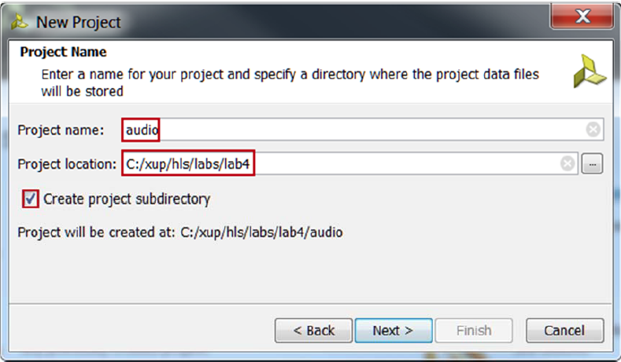
    

    

    <i>Project Name entry</i>
    

10-1-5. Select RTL Project in the Project Type form, and click Next.

10-1-6. Select Verilog as the Target language and Simulator Language in the Add Sources form, and
click Next.
    

    
    

    

    <i>Add sources to new project</i>
    

10-1-7. Click Next two times to skip Adding Existing IP and Add Constraints dialog boxes

10-1-8. In the Default Part form, select Boards, and select Pynq Z1 or Pynq Z2. Click Next.
    

    
    

    

    <i>Boards and Parts selection</i>
    

10-1-9. Check the Project Summary and click Finish to create an empty Vivado project.

### Creating the System Using the IP Integrator

#### 11-1. Use the IP Integrator to create a new Block Design, and generate the ARM Cortex-A9 processor based hardware system.

11-1-1. In the Flow Navigator, click Create Block Design under IP Integrator
    

    
    

    

    <i> Create IP Integrator Block Diagram</i>
    

11-1-2. Enter **system** for the design name and click OK

11-1-3. IP from the catalog can be added in different ways. Click on Add IP in the message at the top of
the Diagram panel, or click the Add IP icon in the block diagram side bar, press Ctrl + I, or
right-click anywhere in the Diagram workspace and select Add IP.

11-1-4. Once the IP Catalog is open, type “zy” into the Search bar, find and double click on **ZYNQ7
Processing System** entry, or click on the entry and hit the Enter key to add it to the design.
    

    
    

    

    <i>The Zynq IP Block</i>
    

11-1-5. Notice the message at the top of the Diagram window that Designer Assistance available. Click
on **Run Block Automation** and select /processing_system7_0

11-1-6. Click OK when prompted to run automation.
    

    
    

    

    <i>Zynq Block with DDR and Fixed IO ports</i>
    
  

11-1-7. In the block diagram, double click on the Zynq block to open the Customization window for the
Zynq processing system.

A block diagram of the Zynq should now be open, showing various configurable blocks of the
Processing System.

At this stage, the designer can click on various configurable blocks (highlighted in green) and
change the system configuration.

#### 11-2. Configure I/O Peripherals block to use UART 1 and I2C 1 peripherals, disabling other unwanted peripherals. Uncheck Timer 0. Enable FCLK_CLK1, the PL fabric clock and set its frequency either to 10.000 MHz for the Pynq

11-2-1. Select the MIO Configuration tab on the left to open the configuration form and expand I/O
Peripheral in the right pane.

11-2-2. Click on the check box of the I2C 1 peripheral. Uncheck USB0, SD 0, ENET 0, GPIO > GPIO
MIO as we don’t need them.

11-2-3. Expand the Application Processing Unit group in the Select the MIO Configuration tab and
uncheck the Timer 0.

11-2-4. Select the Clock Configuration in the left pane, expand the PL Fabric Clocks entry in the right,
and click the check-box of FCLK_CLK1.

11-2-5. Change the Requested Frequency value of FCLK_CLK1 to 10.000 MHz
    

    
    

    

    <i>Enabling and setting the frequency of FCLK_CLK1</i>
    
 
11-2-6. Click OK.
Notice that the Zynq block only shows the necessary ports.

#### 11-3. Add the provided I2C-based IP

11-3-1. In the Flow Navigator pane, click Settings under Project Manager.
    

    
    

    

    <i>Invoking Project Settings</i>
    
 
    
11-3-2. Expand IP > Repository in the left pane.

11-3-3. Click the + button. Browse to **c:\xup\hls\labs\lab4\ip_repo** and click Select.
The directory will be scanned and added in the IP Repositories window, and two IP entry will be
detected.

11-3-4. Click OK to accept the settings.

11-4. Instantiate zed_audio_ctrl and GPIO with width of 2 bits on
channel 1 and width of 1 bit input only on channel 2.

Run connection automation to connect them.

11-4-1. Click the Add IP button if the IP Catalog is not open and search for AXI GPIO in the catalog
by typing gpi and double-click on the AXI GPIO entry to add an instance.

11-4-2. Click on the Add IP to Block Design button.

11-4-3. Double-click on the added instance and the Re-Customize IP GUI will be displayed.

11-4-4. Change the Channel 1 width to 2.

11-4-5. Check the Enable Dual Channel box, set the width to 1 input only, and click OK.

11-4-6. Similarly add an instance of the zed_audio_ctrl.

11-4-7. Notice that Design assistance is available. Click on Run Connection Automation, and select
**/axi_gpio_0/S_AXI**

11-4-8. Click OK to connect it to the M_AXI_GP0 interface.
Notice two additional blocks, Proc Sys Reset, and AXI Interconnect have automatically been
added to the design.

11-4-9. Similarly, click on Run Connection Automation, and select /zed_audio_ctrl_0/S_AXI.

#### 11-5. Make IIC_1, GPIO, FCLK_CLK1, and zed_audio_ctrl ports external.

11-5-1. Select the GPIO interface of the axi_gpio_0 instance, right-click on it and select Make External to
create an external port. This will create the external port named GPIO and connect it to the
peripheral.

11-5-2. Select the GPIO2 interface of the axi_gpio_0 instance, right-click on it and select Make External
to create the external port.

11-5-3. Similarly, selecting one port at a time of the zed_audio_ctrl_0 instance, make them external.

11-5-4. Similarly, make the IIC_1 interface and FCLK_CLK1 port of the processing_system7_0 instance
external.

At this stage the design should look like shown below (you may have to click the regenerate layout button).
    

    
    

    

    <i>Block design after I2C based zed_audio_ctrl core added and connections made for the Pynq</i>
    
 

